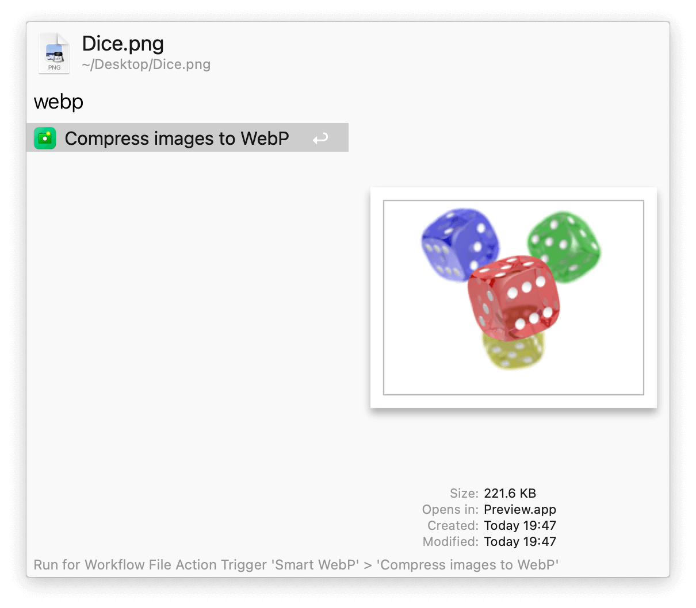
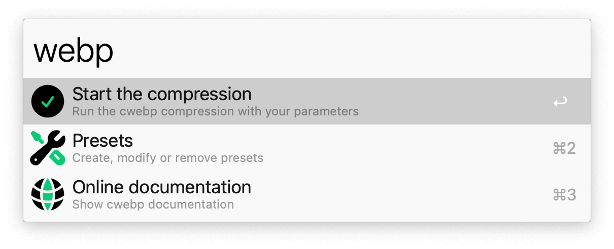
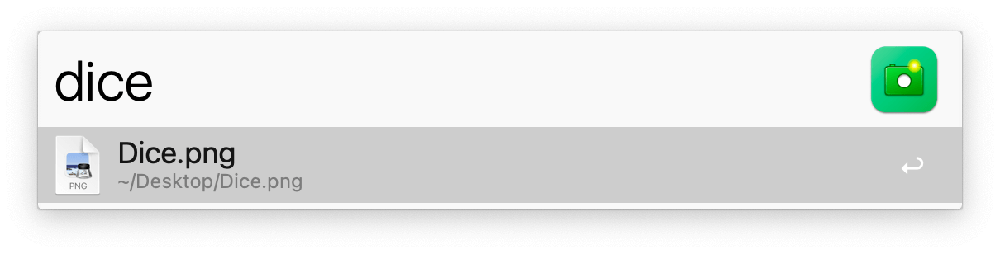
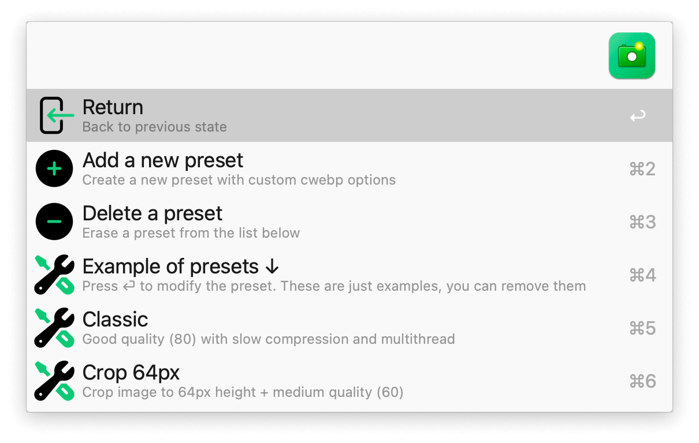

## Usage

Convert images to WebP via the Universal Action. You’ll be able to manually provide compression options or choose from a preset. Multiple images or a folder full of them can be converted at once. Results are saved next to the originals.

Alternatively, search for images to compress via the `webp` keyword followed by `Start the compression`.

The same keyword is used to check the documentation for compression options or to manage presets.

