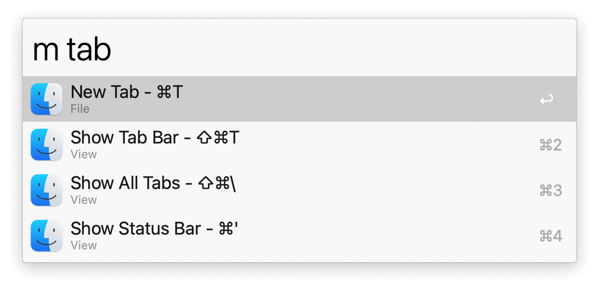
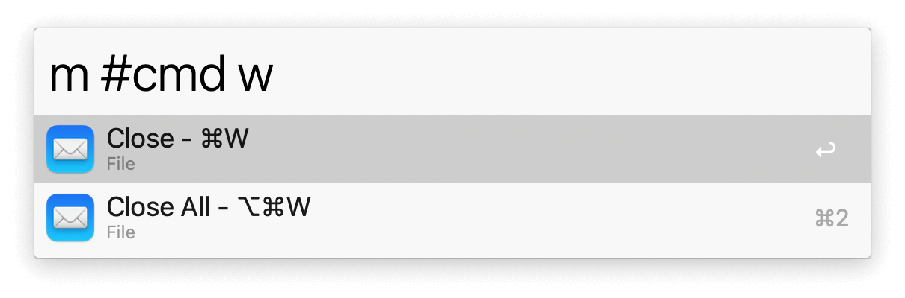

## Usage

Search menubar items of the frontmost app via the `m` keyword. Prepend your query with `#` to search by keyboard shortcut. Press <kbd>↩</kbd> to action the item.

Configure the Hotkey as an alternative to trigger searches.
