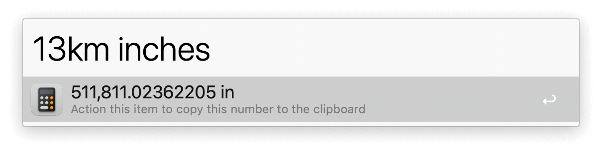
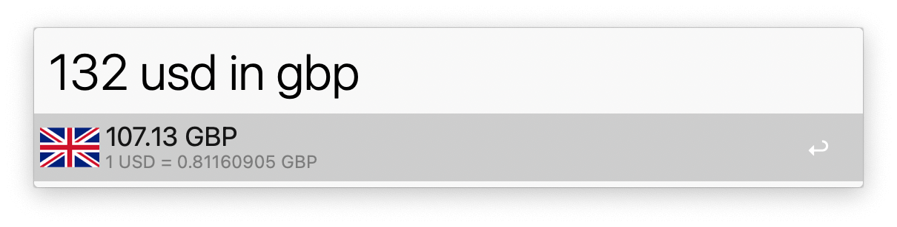
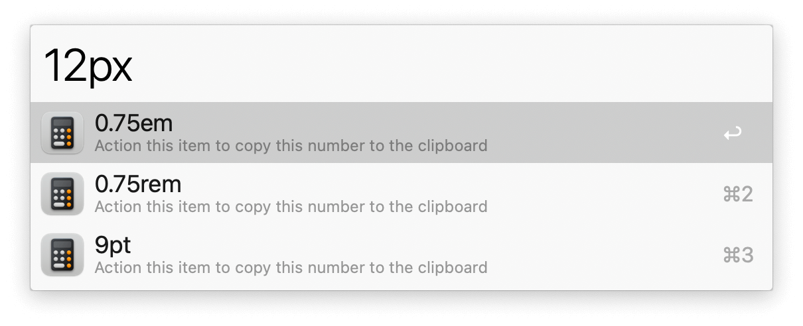
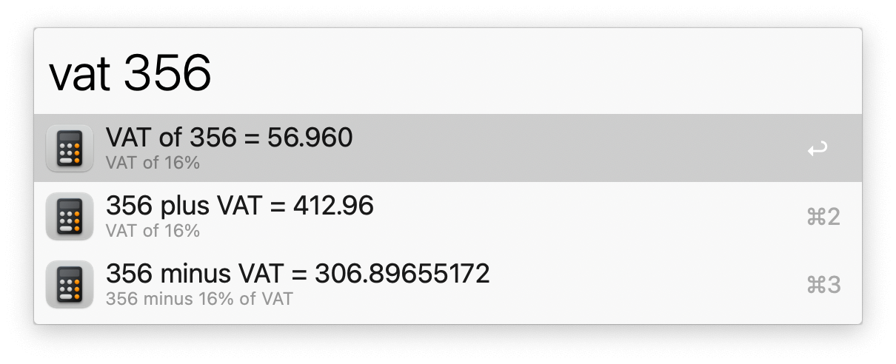
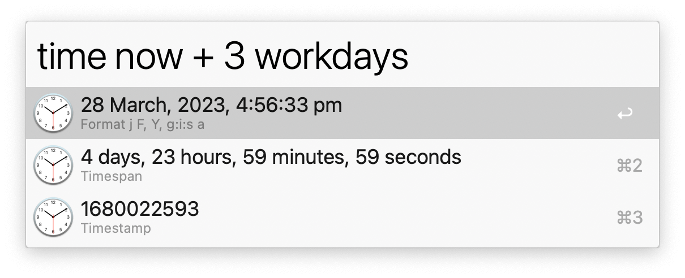

## Usage

Start your query with a number and use natural language to do a conversion. You can convert currencies, measurements, data storage units, percentages, and more.

Convert VAT with the `vat` keyword.

Time conversions use the `time` keyword.

Set defaults for base currencies, VAT percentages, and more in the Workflow’s Configuration.
