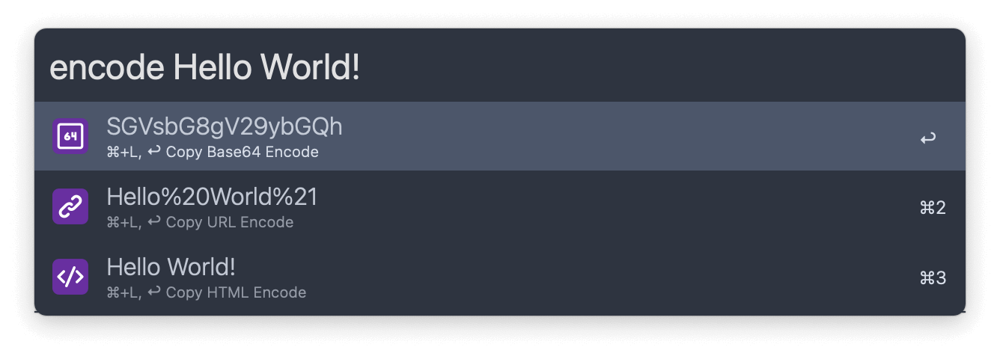
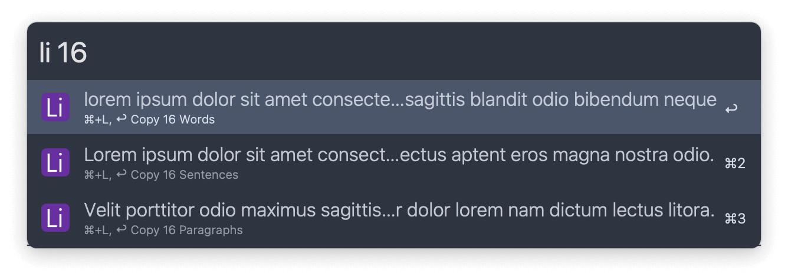
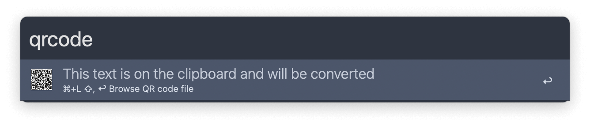
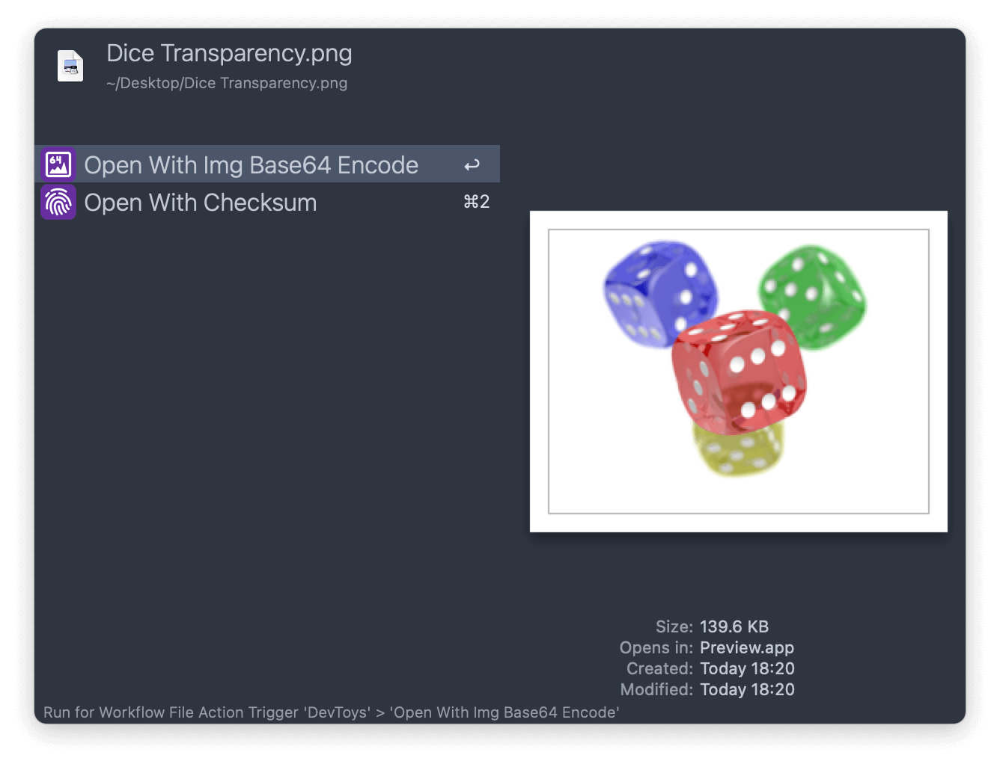
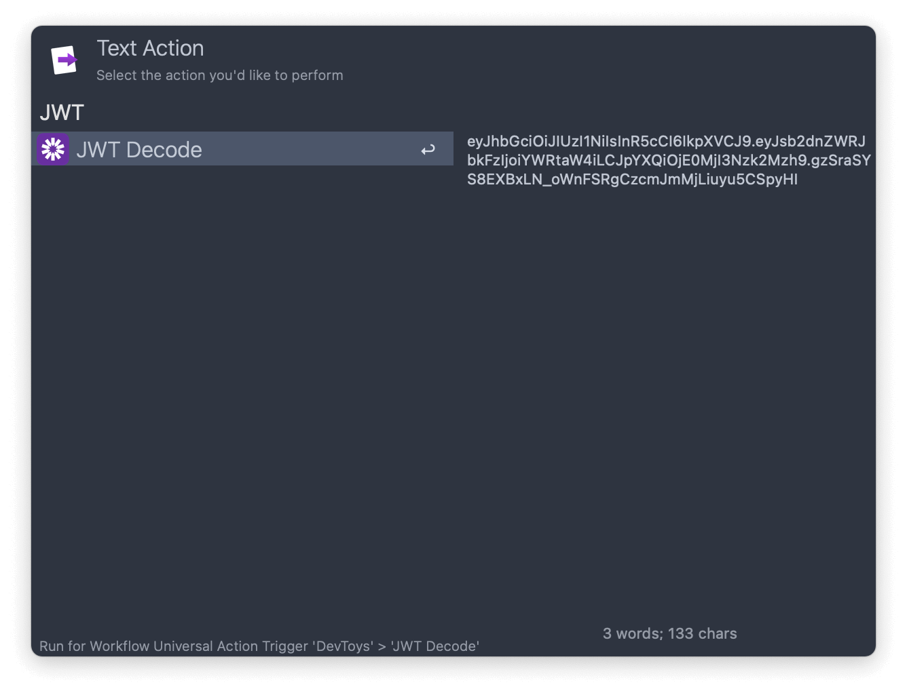

## Usage

Transform and generate text via the workflow’s keywords:

* `encode` Encode string to Base64, URL and HTML.
* `decode` Decode string from Base64, URL and HTML.
* `hash` Generate text hash.
* `imgbase64f` Search for images and generate Base64 encoding.
* `checksumf` Search for files and generate checksum.
* `uuid` Generate UUID.
* `li` Generate [Lorem ipsum](https://en.wikipedia.org/wiki/Lorem_ipsum) (words, sentences, paragraphs).
* `qr code` Generate QR code.
* `cc` Change text case.
* `nb command` Conversion base between decimal, hex, octal and binary.
* `json format` Format or minify JSON.
* `time` Convert date format.

Text in your clipboard will be used by default. Type to convert something else. Press <kbd>↩</kbd> to copy the result to the clipboard.

Decode JWT files or generate image hashes via the Universal Actions.

