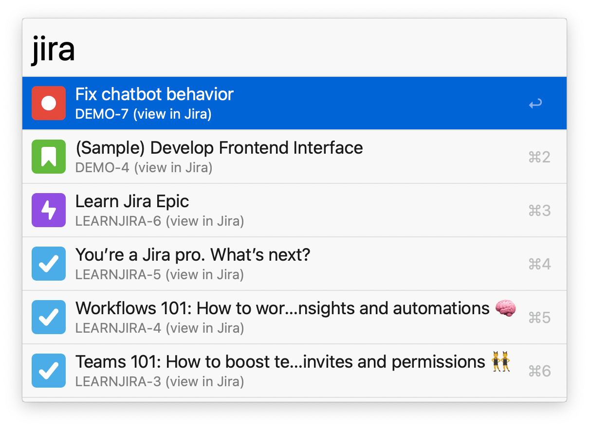
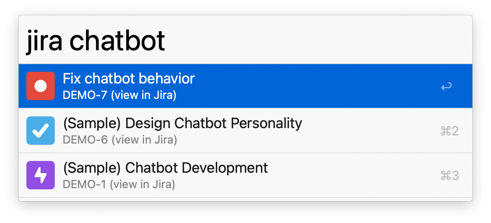

## Setup

In the Workflow’s Configuration, set up:

1. The base URL of your Atlassian team (e.g. `https://yourcompany.atlassian.net`).
2. The username of your Jira account.
3. An [access token for your Jira account](https://id.atlassian.com/manage-profile/security/api-tokens) (Atlassian account settings→ Security → API tokens).

## Usage

Search your issues via the `jira` keyword. If you don't provide a query, your most recent issues are shown.

* <kbd>↩</kbd> Open the issue page in a web browser.
* <kbd>⌘</kbd><kbd>↩</kbd> Copy the issue’s ID.
* <kbd>⌥</kbd><kbd>↩</kbd> Copy the issue’s URL.
* <kbd>⇧</kbd><kbd>↩</kbd> Copy the issue’s summary.

Optionally restrict your search to one or more projects in the Workflow’s Configuration. Enter a comma-separated list of project keys (e.g. if you want tickets like `ABC-123` and `DEF-234`, enter `ABC, DEF` into the field).
