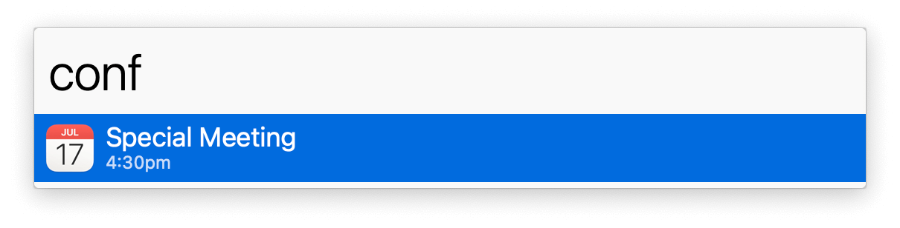

## Usage

See a list of upcoming calendar events via the `conf` keyword. Events listed fall within (by default) 20 minutes of your system’s current time. Even if running late to a meeting, the logical event will show.

Timezones and Daylight Saving Time (DST) are accounted for. All times display in your system’s local timezone.
