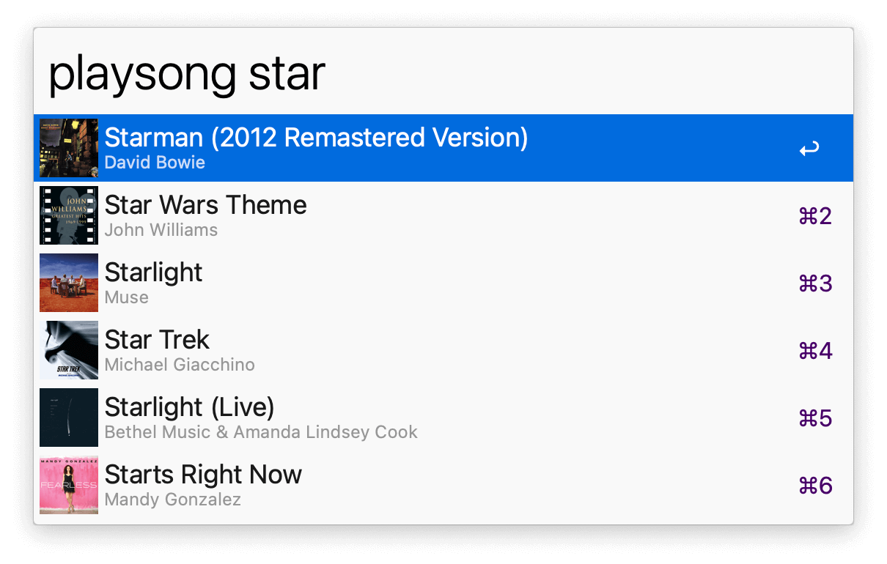
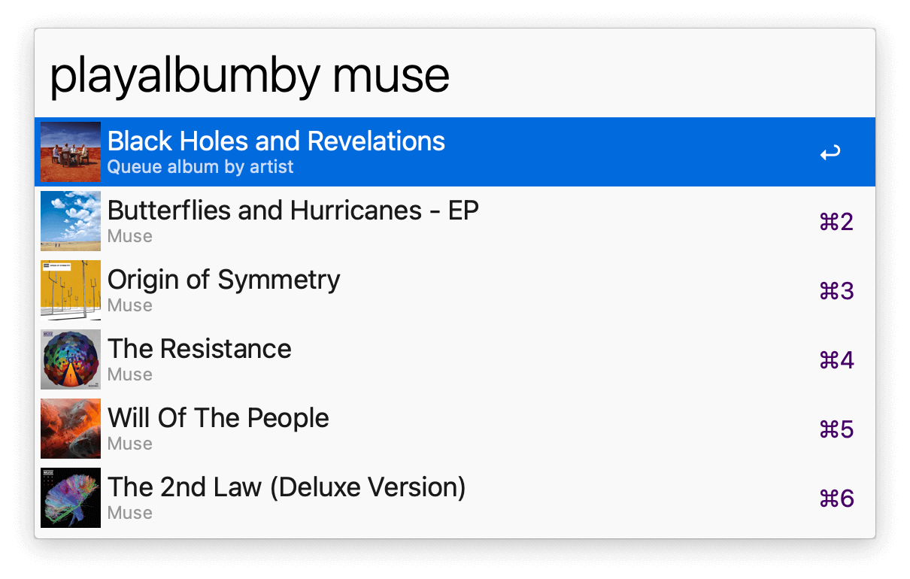

## Usage

Control Music.app through the available keywords:

* `playsong` Play song.
* `playsongin` Play song in a particular album.
* `playsongby` Play song by a particular artist.
* `playalbum` Play album.
* `playalbumby` Play album by a particular artist.
* `playartist` Play artist.
* `playgenre` Play genre.
* `playplaylist` Play playlist.
* `playqueue` Play songs in queue (add with <kbd>⌘</kbd><kbd>↩</kbd>).
* `clearqueue` Clear songs in queue.
* `shuffleon` Turn shuffle on.
* `shuffleoff` Turn shuffle off.
* `shuffletoggle` Toggle shuffle.

* <kbd>↩</kbd> Play selection.
* <kbd>⌘</kbd><kbd>↩</kbd> Add to queue.
* <kbd>⌃</kbd><kbd>↩</kbd> Search on Google.

If you experience an issue such as outdated artwork, run `clearcache`.
