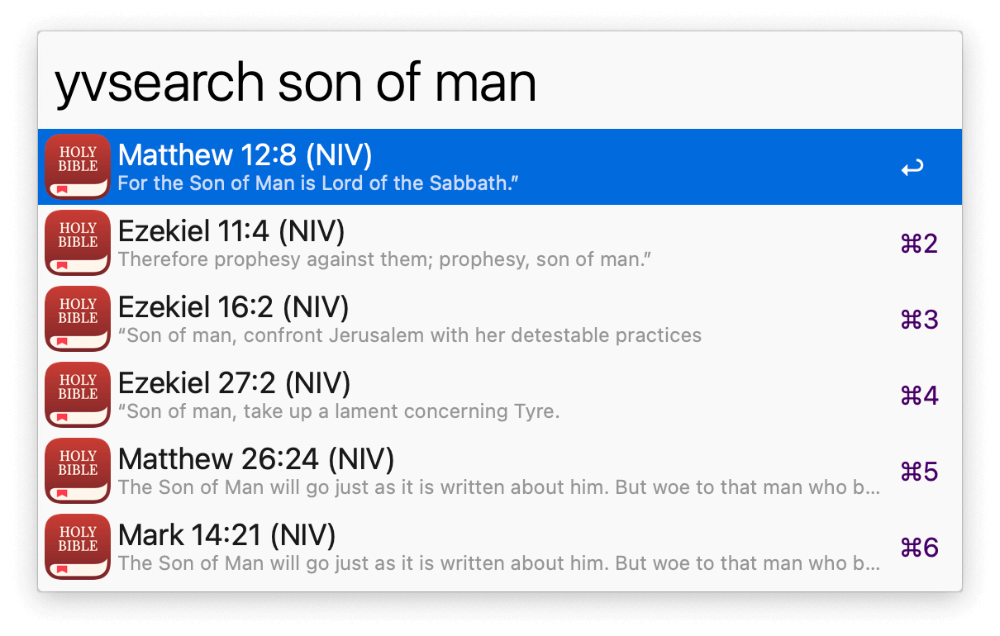
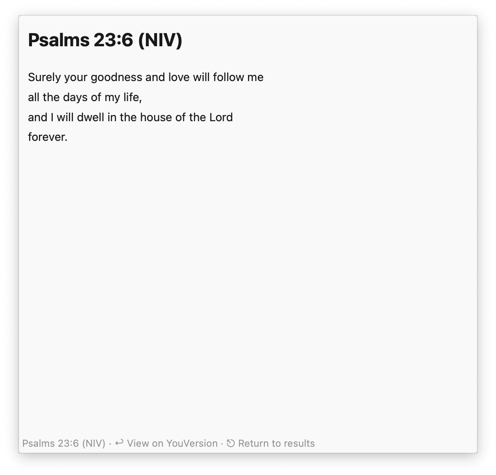
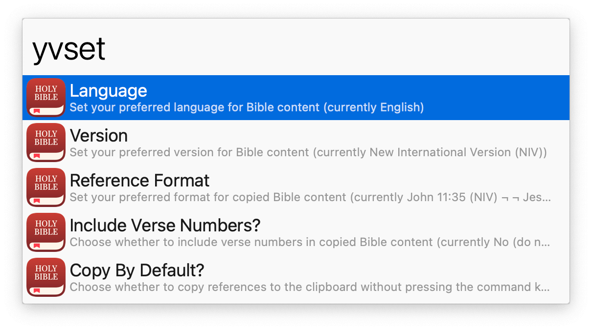

## Usage

Search the [YouVersion](https://www.youversion.com/) Bible by reference (book, chapter, verse, or range of verses) via the `yvfilter` keyword.

Search by content with `yvsearch`.

* <kbd>↩</kbd> Open reference on the YouVersion website.
* <kbd>⌘</kbd><kbd>↩</kbd> Copy reference to the clipboard.
* <kbd>⌥</kbd><kbd>↩</kbd> Copy reference URL to the clipboard.
* <kbd>⌃</kbd><kbd>↩</kbd> Search reference in Google.
* <kbd>⇧</kbd><kbd>↩</kbd> See reference in Text View.
* <kbd>⌘</kbd><kbd>⇧</kbd><kbd>↩</kbd> Filter by reference.
* <kbd>⌘</kbd><kbd>C</kbd> Copy reference identifier to the clipboard.

List configurable options with `yvset`.

