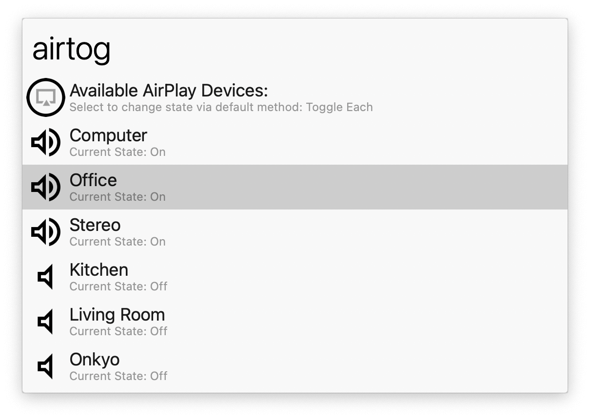

## Usage

List the playing state of your AirPlay devices via the `airtog` keyword. By default <kbd>↩</kbd> toggles the state for that device only, but that can be changed to only allow one device at a time in the Workflow’s Configuration.

* <kbd>↩</kbd> Default toggle mode.
* <kbd>⌥</kbd><kbd>↩</kbd> Alternative toggle mode.
* <kbd>⌃</kbd><kbd>↩</kbd> Toggle and do not hide Alfred.
