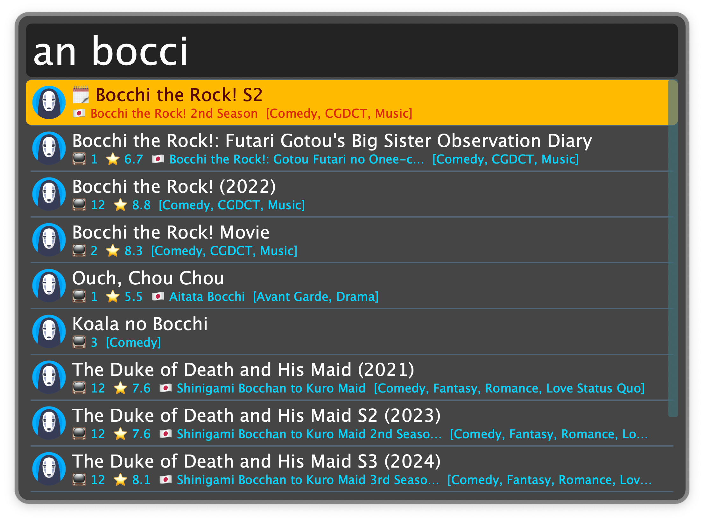
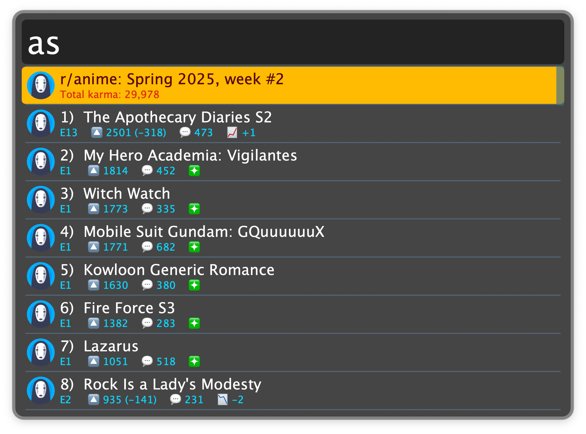

## Usage

Search all anime listed in the [MyAnimeList](https://myanimelist.net) database via the `an` keyword.

* <kbd>↩</kbd> Open on MyAnimeList or [AniList](https://anilist.co).
* <kbd>⌘</kbd><kbd>↩</kbd> Copy the Japanese (romaji) title.
* <kbd>⌥</kbd><kbd>↩</kbd> Copy the MyAnimeList or AniList URL.
* <kbd>⇧</kbd><kbd>↩</kbd> Search on configured alternative site.
* <kbd>⌘</kbd><kbd>Y</kbd> Quick Look the hero image or MyAnimeList page of the entry.

Access the [r/anime](https://www.reddit.com/r/anime/) weekly seasonal rankings via the `as` keyword.

* <kbd>↩</kbd> Open weekly episode discussion thread at reddit.
* <kbd>⌘</kbd><kbd>↩</kbd> Open the show at MyAnimeList or AniList.
* <kbd>⇧</kbd><kbd>↩</kbd> Open the episode at the streaming site, if available.
* <kbd>⌃</kbd><kbd>↩</kbd> Toggle between showing the previous and the ongoing week.
* <kbd>⌘</kbd><kbd>Y</kbd> Quick Look the hero image of the show/episode.
