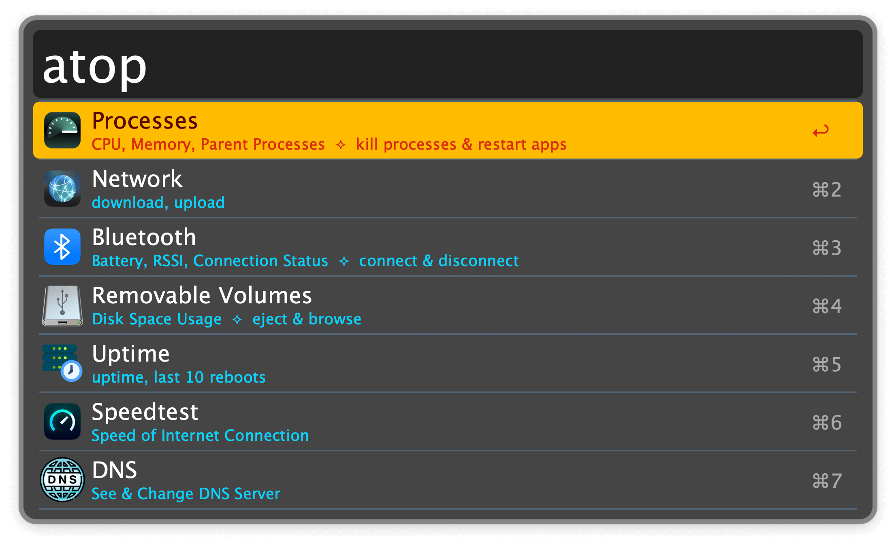
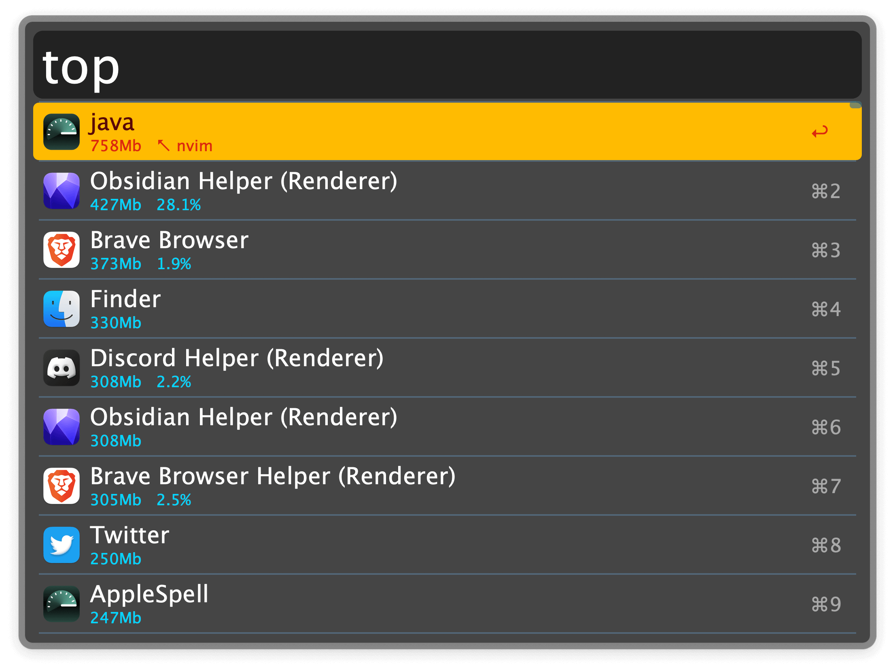
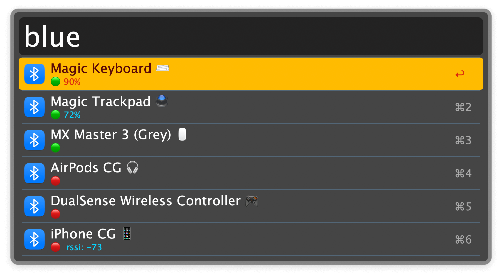
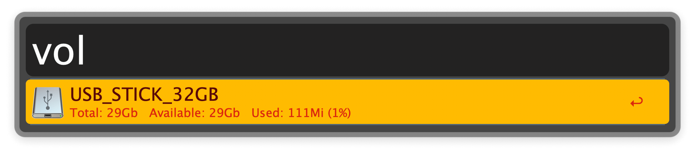
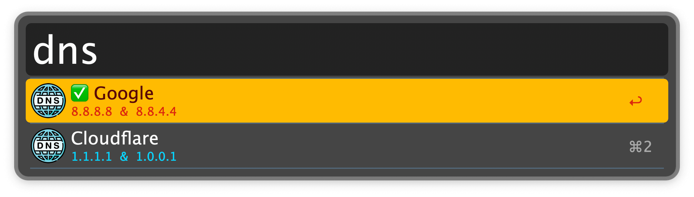

## Usage

List all available tools via `atop`. The most frequently used have their own configurable keywords.

### Processes

Search running processes with the `top` keyword. Append "parent" to the query to display
only processes that have child processes.

* <kbd>↩</kbd>: Kill the process.
* <kbd>⌘</kbd><kbd>↩</kbd>: Force kill the process.
* <kbd>⌃</kbd><kbd>↩</kbd>: Kill all processes with the same name.
* <kbd>⌘</kbd><kbd>⌃</kbd><kbd>↩</kbd>: Force kill all processes with the same name.
* <kbd>⇧</kbd><kbd>↩</kbd>: If the process belongs to a regular app, it.
* <kbd>fn</kbd><kbd>↩</kbd>: Toggle between sorting processes by memory or CPU.
* <kbd>⌘</kbd><kbd>C</kbd>: Copy the process identifier (PID).
* <kbd>⌥</kbd><kbd>↩</kbd>: Copy the process path.

#### Icon legend

* `⭕` indicates that the process is owned by root.
* `n⇣` means that the process is a parent of `n` child processes.
* `↖ foobar` indicates that the process is a child of `foobar`.

### Bluetooth

Search paired bluetooth devices with the `blue` keyword.

* <kbd>↩</kbd> Connect/Disconnect the selected device.
* <kbd>⌥</kbd><kbd>↩</kbd> Copy device address.

### Removable Volumes

Search mounted volumes via the `vol` keyword.

* <kbd>↩</kbd> Open the Volume in the Finder.
* <kbd>⌘</kbd><kbd>↩</kbd> Browse the Volume in terminal.
* <kbd>⌃</kbd><kbd>↩</kbd> Eject Volume.

### DNS

Change DNS servers via the `dns` keyword.

