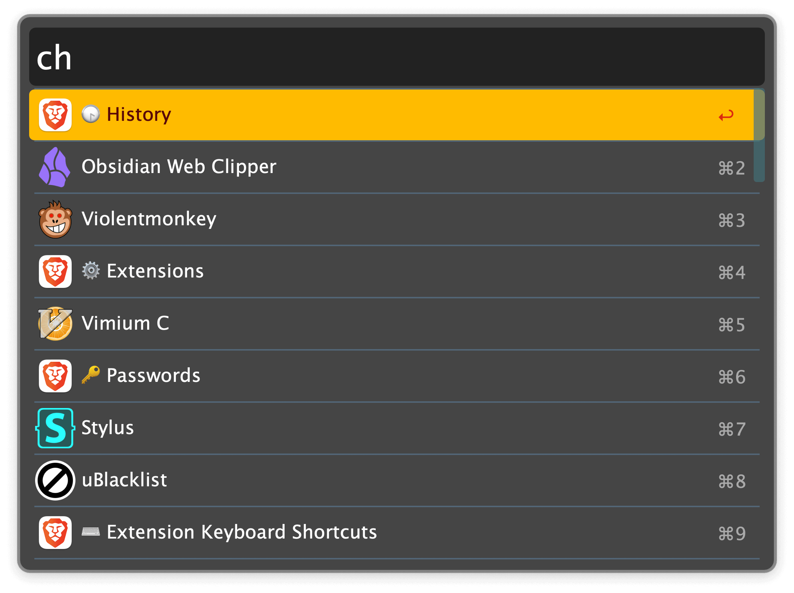

## Usage

Search for installed browser extensions and internal pages of Chromium browsers via the `ch` keyword.

* <kbd>↩</kbd> Open page, or the respective extension settings.
* <kbd>⌘</kbd><kbd>↩</kbd> Open the extension at the Chrome Web Store.
* <kbd>⌥</kbd><kbd>↩</kbd> Copy the Chrome Web Store URL of the extension.
* <kbd>⇧</kbd><kbd>↩</kbd> Open the local file path of the extension.
