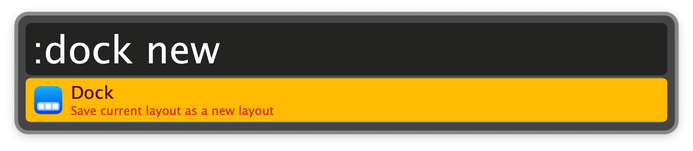
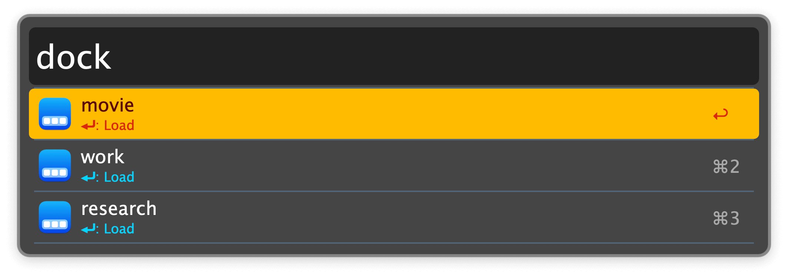

## Usage

Save the current dock layout for this workflow via the `:dock new` keyword.



Select a saved layout via the `dock` keyword.



* <kbd>↩</kbd> Switch to (load) the layout.
* <kbd>⌘</kbd><kbd>↩</kbd> Overwrite with the layout of the current dock.

### Automation

Trigger a layout load from another app via AppleScript:

```
tell application id "com.runningwithcrayons.Alfred" to run trigger "load-dock-layout" in workflow "de.chris-grieser.dock-switcher" with argument "NAME_OF_DOCK_LAYOUT"`
```

Or via URL handler:

```
alfred://runtrigger/de.chris-grieser.dock-switcher/load-dock-layout/?argument=NAME_OF_DOCK_LAYOUT
```

Replace `NAME_OF_DOCK_LAYOUT` with the name of the desired layout.
