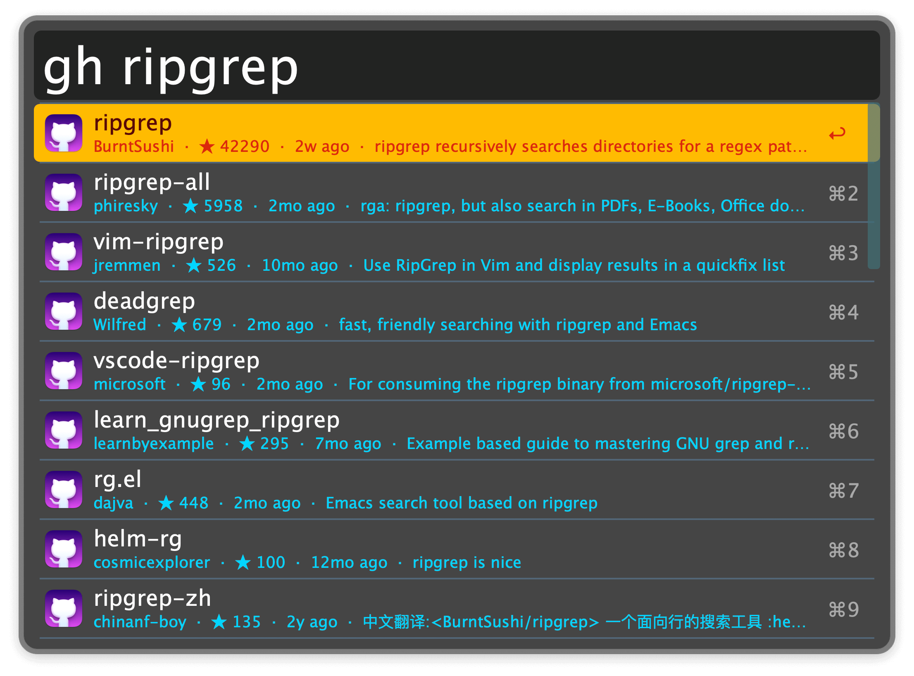
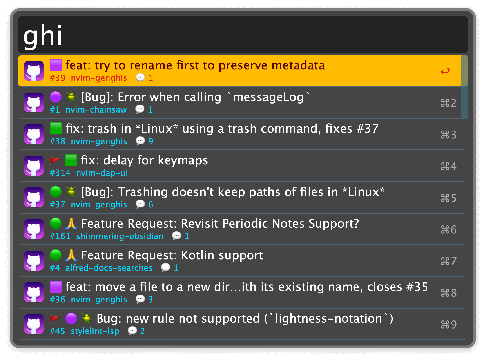

## Usage

### Search All Repos

Search all public GitHub repositories via the `gh` keyword.

* <kbd>↩</kbd> Open the repo's GitHub page.
* <kbd>⌘</kbd><kbd>↩</kbd> Open the repo's homepage. If it has none, opens the releases page instead.
* <kbd>⌥</kbd><kbd>↩</kbd> Copy the repo URL.
* <kbd>⌃</kbd><kbd>↩</kbd> Shallow clone the repo to a local folder and open in the Terminal. Optionally, creates a fork on GitHub with the `gh` cli and prepares the repo for a PR.
* <kbd>⇧</kbd><kbd>↩</kbd> Search the repo for a query via GitHub Code Search.

### Search Issues

Search recent GitHub issues you are involved in with the `ghi` keyword.

* <kbd>↩</kbd> Open the issue in the browser.
* <kbd>⌥</kbd><kbd>↩</kbd> Copy the issue URL.

### Search Your Public Repos

Quick access the public repositories you own via the `gmy` keyword.

* <kbd>↩</kbd> If the repo is available locally on your device, open it in the Terminal. Otherwise, open the repo's GitHub page.
* <kbd>⌘</kbd><kbd>↩</kbd> Open the repo's GitHub page.
* <kbd>⌥</kbd><kbd>↩</kbd> Copy the repo link.
* <kbd>⌃</kbd><kbd>↩</kbd> Shallow clone the repo to a local folder and open in the Terminal. If the repo is already locally available on your device, just open the repository in the Terminal.

### Search Pull Requests

Access Pull Requests (PRs) you have opened with the `gpr` keyword.

* <kbd>↩</kbd> Open the PR in the browser.
* <kbd>⌥</kbd><kbd>↩</kbd> Copy the link to the PR.

### View Notifications

Directly open your GitHub notification via the `ghn` keyword. This requires a [GitHub Token](https://github.com/settings/tokens) with access to notifications.

* <kbd>↩</kbd> Open the notification in the browser.
* <kbd>⌘</kbd><kbd>↩</kbd> Mark the notification as read.
* <kbd>⌥</kbd><kbd>↩</kbd> Copy the URL of the notification target.
* <kbd>⇧</kbd><kbd>↩</kbd> Mark the notification as done.
