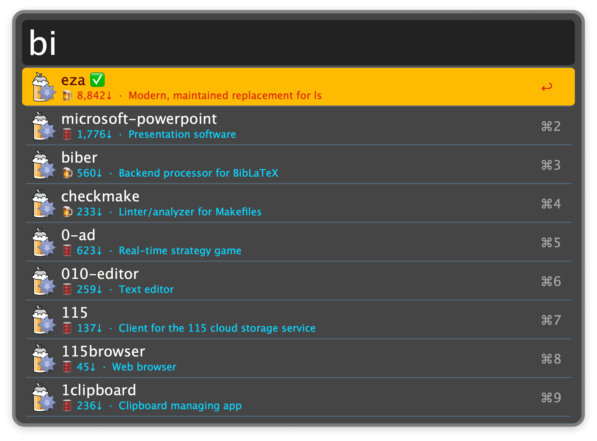
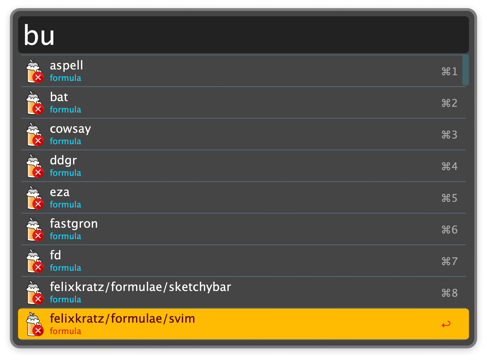

## Usage

### Install

Search and install Homebrew packages via the `bi` keyword.

* <kbd>↩</kbd> Install package (`brew install`) in the terminal.
* <kbd>⌘</kbd><kbd>↩</kbd> Open package homepage (`brew home`).
* <kbd>⌥</kbd><kbd>↩</kbd> Copy package homepage to the clipboard.
* <kbd>⇧</kbd><kbd>↩</kbd> Show package information (`brew info`) in Text View.
* <kbd>⌃</kbd><kbd>↩</kbd> Reinstall package (`brew reinstall`).
* <kbd>⌘</kbd><kbd>Y</kbd> Quick Look screenshot of the app, if available.

### Uninstall

Uninstall packages via the `bu` keyword.

* <kbd>⇧</kbd><kbd>↩</kbd> Show package information (`brew info`) in Text View.
* <kbd>⌃</kbd><kbd>↩</kbd> Reinstall package (`brew reinstall`).
