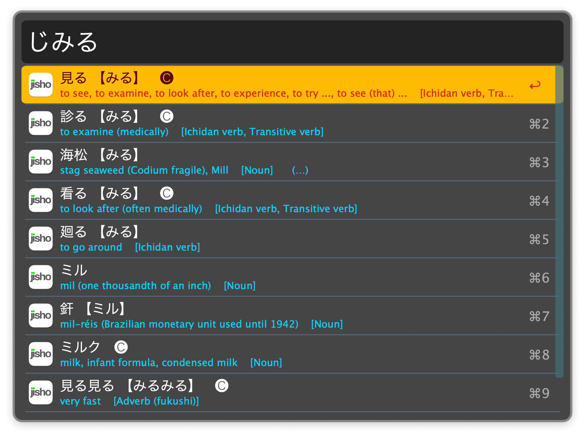
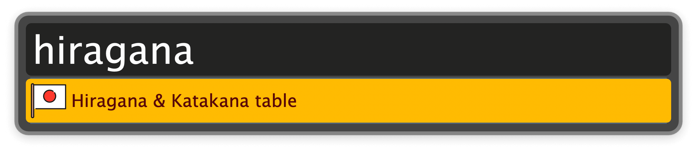
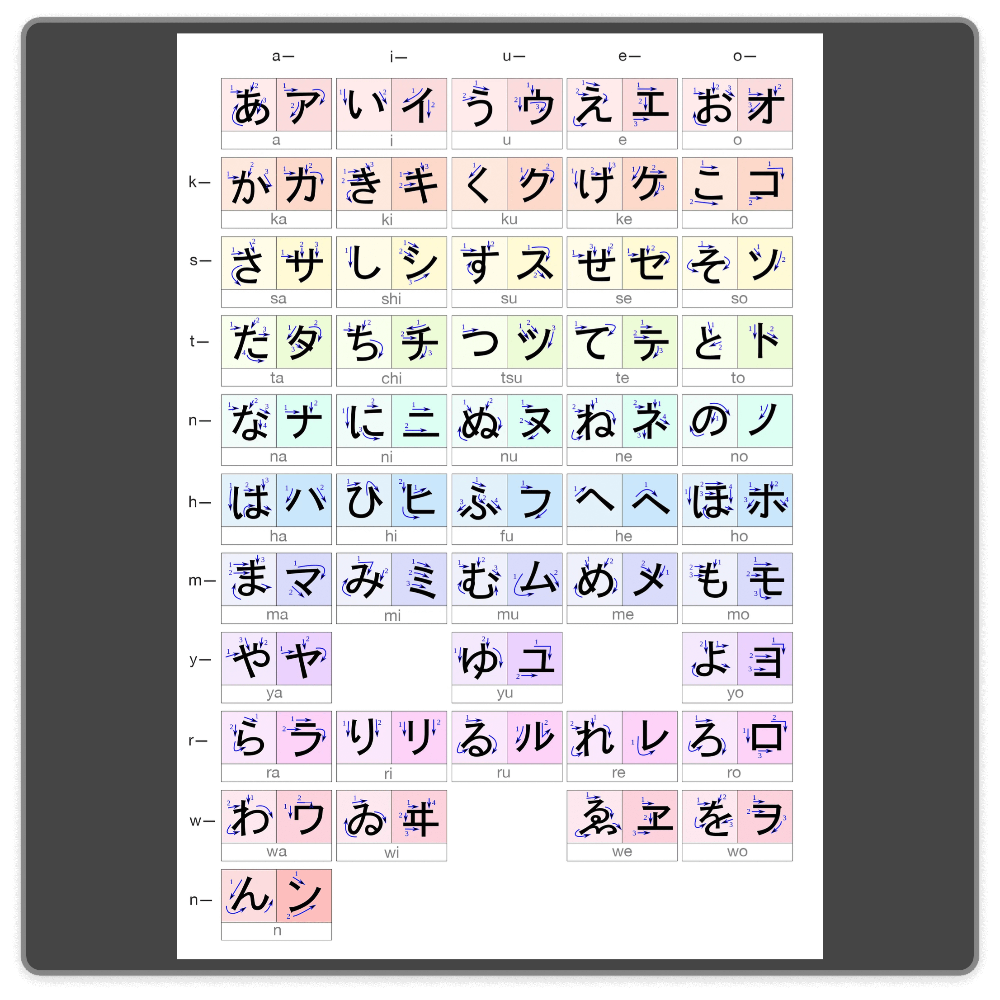
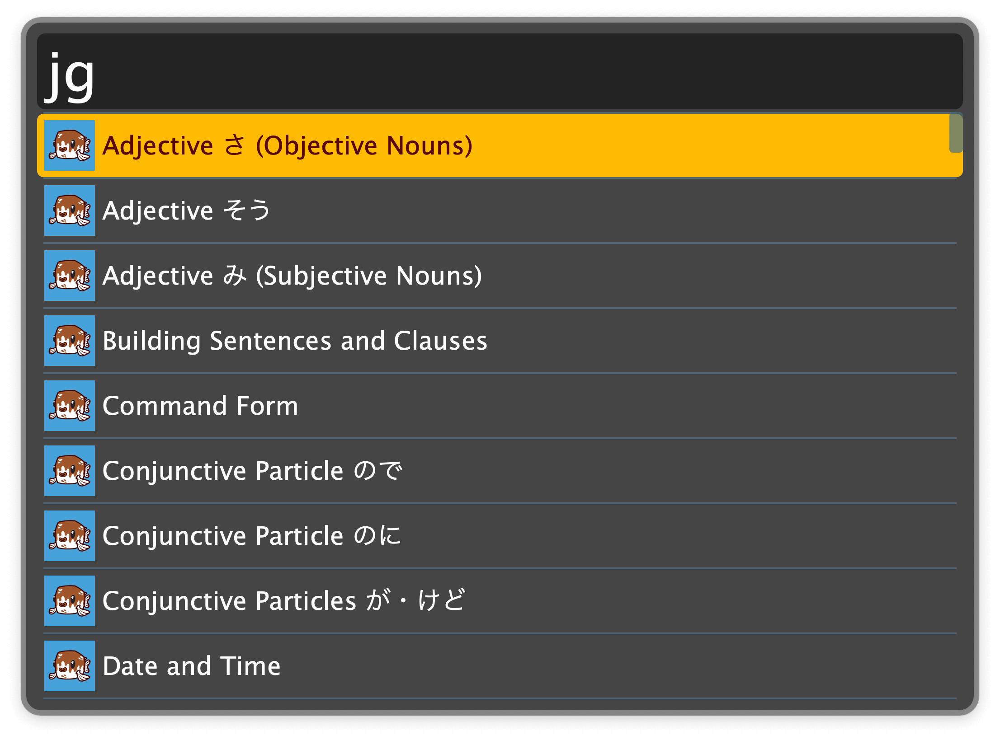

## Usage

Search for a word in English or in Japanese (Romaji, Kana, Kanji) via the `ji` or `じ` keywords.

* <kbd>↩</kbd> Copy the Japanese translation.
* <kbd>⌘</kbd><kbd>↩</kbd> Open the word at jisho.org (or an alternative dictionary site).
* <kbd>⌥</kbd><kbd>↩</kbd> Copy the URL to the entry at the selected dictionary site.
* <kbd>⇧</kbd><kbd>↩</kbd> Play the Japanese audio pronunciation, with configurable speech rate.
* <kbd>⌃</kbd><kbd>↩</kbd> Open the first “Read more” link of the entry in the browser.
* <kbd>fn</kbd><kbd>↩</kbd> Append entry to a .csv file. Useful to import words into other tools, such as Anki.

Configure the Hotkey for faster triggering.

Display a kana cheatsheet via the `hiragana` or `katakana` keywords.

Look for Japanese grammar guides with the `jg` keyword.

