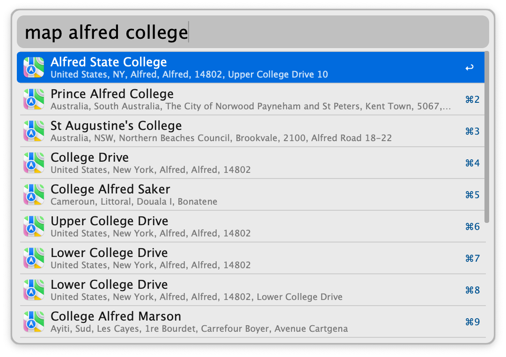

## Usage

Search for locations with the keyword `map` and open them in Apple Maps or
Google Maps.

- <kbd>↩</kbd> open the location at the primary map provider.
- <kbd>⌘</kbd><kbd>↩</kbd> open the location at the secondary map provider.
- <kbd>⌥</kbd><kbd>↩</kbd> copy the URL of the primary map provider.
- <kbd>⌃</kbd><kbd>↩</kbd> copy the address.
- <kbd>⇧</kbd><kbd>↩</kbd> copy the coordinates.
