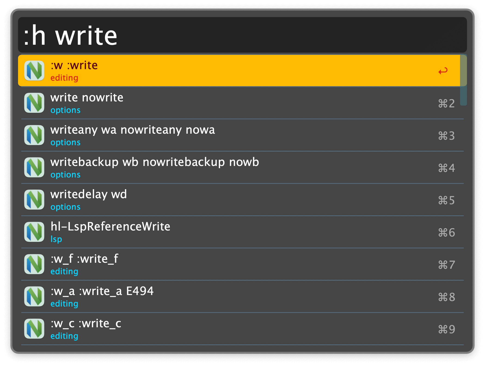
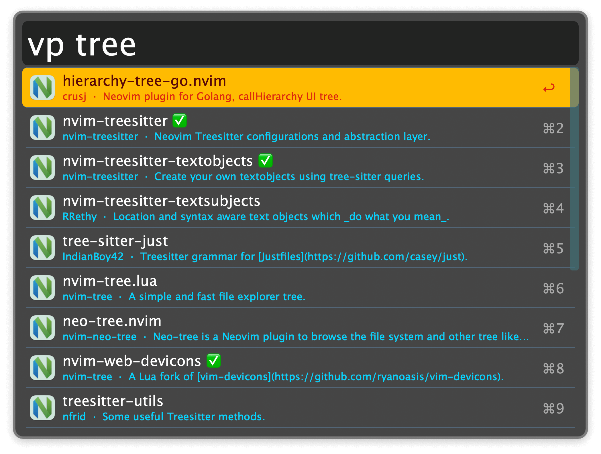

## Usage

Search the [Neovim documentation](https://neovim.io/doc/user/) via the `:h` keyword.

* <kbd>↩</kbd> Open the help page in the web browser.
* <kbd>⌥</kbd><kbd>↩</kbd> Copy page URL.
* <kbd>⌘</kbd><kbd>Y</kbd> Quick Look the page.

Search [awesome-neovim](https://github.com/rockerBOO/awesome-neovim/) with the `vp` keyword.

* <kbd>↩</kbd> Open the plugin’s GitHub repository.
* <kbd>⌘</kbd><kbd>↩</kbd> Open the help page of the plugin on GitHub.
* <kbd>⌥</kbd><kbd>↩</kbd> Copy the GitHub URL.
* <kbd>⇧</kbd><kbd>↩</kbd> Search GitHub issues of the plugin.

Search for locally installed plugins via the `ip` keyword. The modifiers <kbd>⌘</kbd><kbd>⌥</kbd><kbd>⌃</kbd><kbd>⇧</kbd> above also apply. In addition, <kbd>fn</kbd><kbd>↩</kbd> opens the local directory of the plugin in the Finder.

Search for tools available via [mason.vim](https://github.com/williamboman/mason.nvim) with the `mason` keyword.

Display your old files via the `:old` keyword. They are opened in the default editor for the respective file type. To open them directly in neovim, you need a neovim GUI with “Open With” capability.
