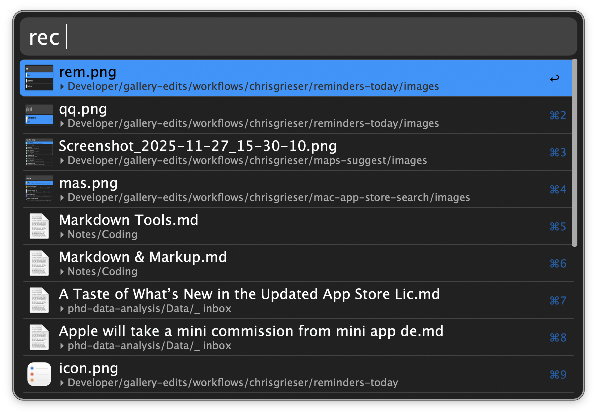

## Usage

Search for recently modified files in your home folder and iCloud documents via the `rec` keyword.

* <kbd>↩</kbd> Open the file.
* <kbd>⌘</kbd><kbd>↩</kbd> Move the file to the frontmost Finder window.
* <kbd>⌥</kbd><kbd>↩</kbd> Reveal the file in Finder.
* <kbd>⌃</kbd><kbd>↩</kbd> Copy the file to the clipboard.
* <kbd>⇧</kbd><kbd>↩</kbd> Remove tag from file when in tag search.
* <kbd>⌘</kbd><kbd>Y</kbd> Quick Look the file.

Other keywords are available to search for files in different locations:

* `dl` Search the Downloads folder.
* `win` Search the frontmost Finder window.
* `tag` Search files you assigned a tag to.
* `trash` Search files in the Trash.

For all five cases, you can change the keyword in the Workflow’s Configuration or configure a Hotkey.
