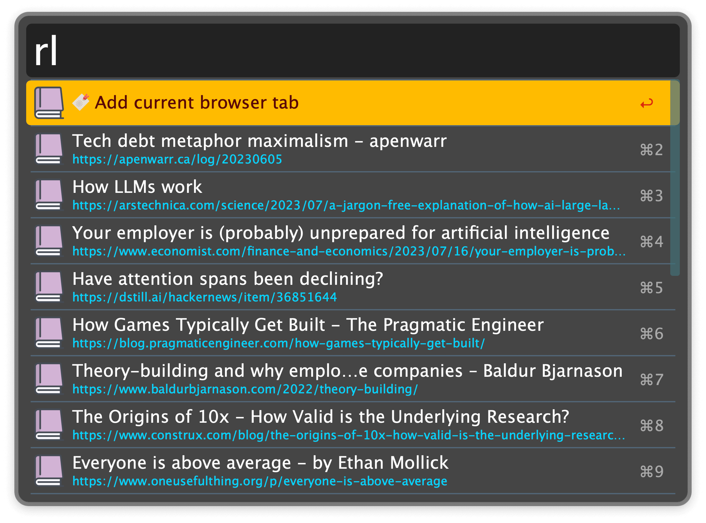

## Usage

Add the frontmost browser tab to your read later list via the `rl` keyword. The same keyword allows you to view your previously saved items.

* <kbd>↩</kbd> Open item in web browser and mark it as read.
* <kbd>⌘</kbd><kbd>↩</kbd> Mark item as read.
* <kbd>⌥</kbd><kbd>↩</kbd> Open item and keep unread.

Items are formatted as markdown for easy interoperability with other apps. The list is a single file, which allows for simple backup and synchronisation.
