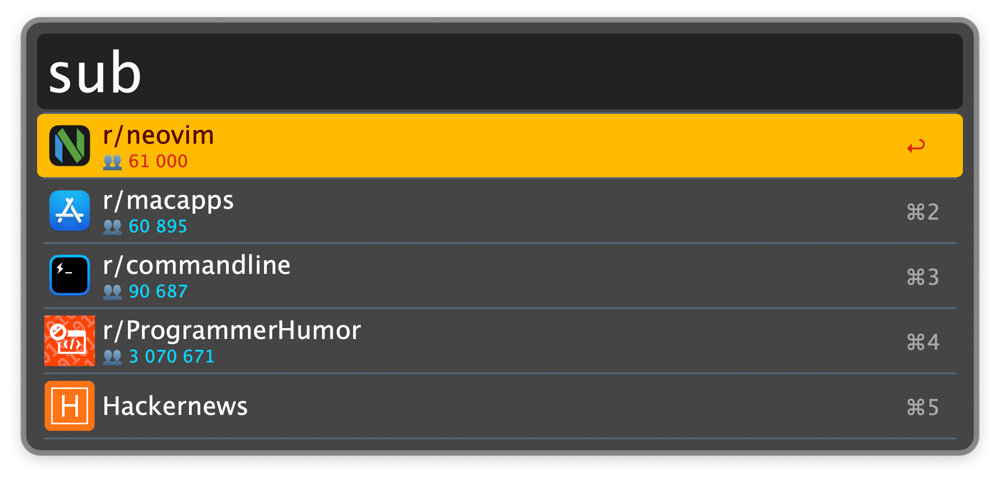
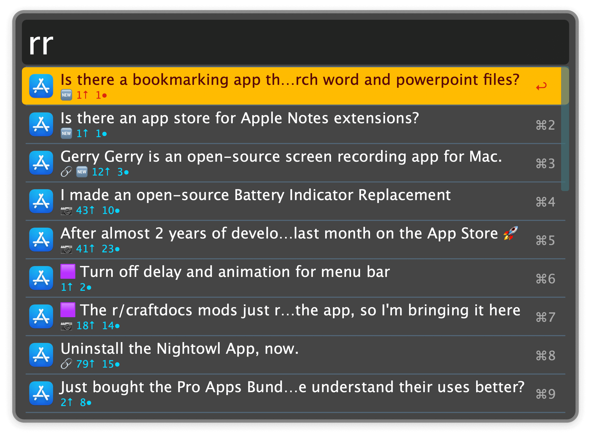
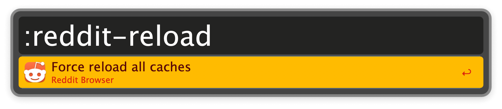

## Usage

Select a subreddit via the `sub` keyword. You can add [Hacker News](https://news.ycombinator.com) to the list in the Workflow’s Configuration, where you can also customise which posts you see or save the scrolling position.

* <kbd>↩</kbd> Browse subreddit in Alfred.
* <kbd>⌘</kbd><kbd>↩</kbd> Open subreddit in browser.

Browse the current subreddit via the `rr` keyword.

* <kbd>↩</kbd> Open Post on reddit.
* <kbd>⌘</kbd><kbd>↩</kbd> Switch to next subreddit.
* <kbd>⇧</kbd><kbd>⌘</kbd><kbd>↩</kbd> Switch to previous subreddit.
* <kbd>⌥</kbd><kbd>↩</kbd> Copy URL of post to clipboard.
* <kbd>⇧</kbd><kbd>↩</kbd> Open external URL (if there is one).
* <kbd>⌘</kbd><kbd>Y</kbd> (or tap <kbd>⇧</kbd>) Preview the result. Mostly useful for images.

Force reload caches with the `:reddit-reload` keyword.

