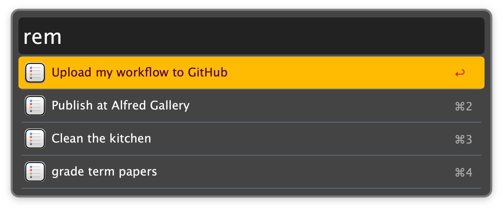
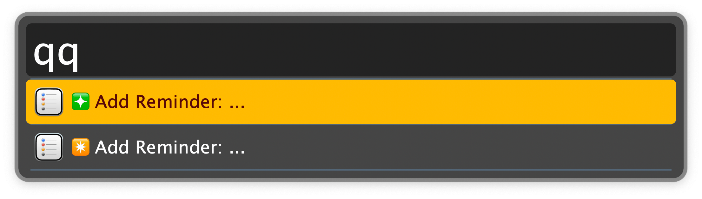

## Usage

Display reminders due today (or overdue) via the `rem` keyword. Configure the Hotkey for faster triggering.

* <kbd>↩</kbd> Complete the reminder. If an event and the location is a URL, open it; otherwise open Google Maps with the location.
* <kbd>⌘</kbd><kbd>↩</kbd> Complete the reminder. If it has a URL open it in the default browser, otherwise copy its title and notes to the clipboard.
* <kbd>⌥</kbd><kbd>↩</kbd> Edit the reminders title and body in Alfred's Text View. The first line is the reminder’s title, the remaining lines the notes.
* <kbd>⇧</kbd><kbd>↩</kbd> Snooze the reminder by changing its due date to tomorrow.
* <kbd>⌃</kbd><kbd>↩</kbd> Toggle completed reminders due today. <kbd>↩</kbd> on a completed reminder marks it as uncompleted.
* <kbd>⌘</kbd><kbd>C</kbd> Copy reminder title and notes.
* <kbd>⌘</kbd><kbd>L</kbd> Display the reminder details in Large Type
* <kbd>⌘</kbd><kbd>Y</kbd> Quick Look the URL (if there is one).

Quickly add a new reminder due today, tomorrow, in two days, or next Monday via the `qq`, `q1`, `q2`, or `qm` keyword, respectively.

The commands support simple parsing of a due time with the format `hh:mm`. For instance, `19:00 buy milk` or `buy milk 19:00` will set the due time to `19:00` and the reminder title to `buy milk`.

A priority can be specified by adding the respective number of `!` *at the end or the beginning*. For example, `buy milk!!` or `!!buy milk` will result in a reminder with the title `buy milk` with a medium priority. (`!` = low, `!!` = medium, `!!!` = high).
