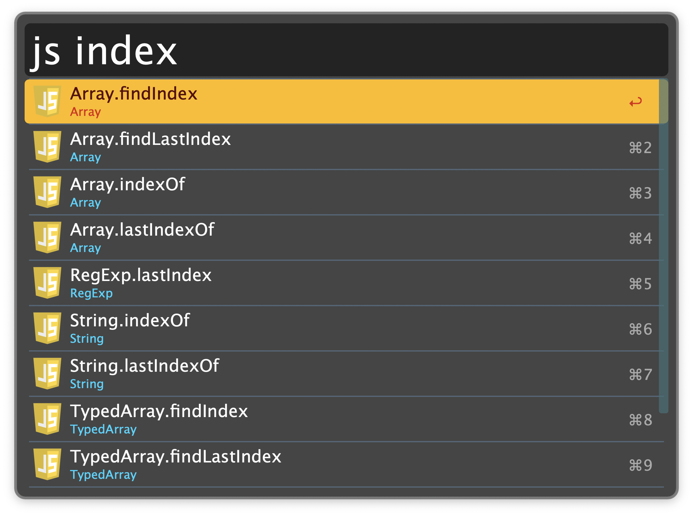

## Setup

Enable the [DevDocs](https://devdocs.io) you want to search in the Workflow’s Configuration.

## Usage

Search documentation via the workflow’s keywords, which follow the same name as the enabled devdocs. For example, `haskell foobar` searches the Haskell DevDocs for “foobar”. A few common languages have short-hands noted in the popup selection, such as `js` for JavaScript. In this case, you use `js foobar` to search instead.

* <kbd>↩</kbd>: Open the documentation site.
* <kbd>⌥</kbd><kbd>↩</kbd>: Copy the URL of the documentation site to the clipboard.
* <kbd>⌘</kbd><kbd>↩</kbd>: Copy the entry’s text to the clipboard.

### Additional Documentation Keywords

Extra documentation sites not included in DevDocs with their own keywords include:

* `biome`: biome docs and rules.
* `ruff`: ruff docs and rules.
* `sc`: shellcheck wiki.
* `pandoc`: pandoc user manual.
* `wt`: WezTerm docs.
* `just`: [just](https://just.systems/man/en/) docs.
* `yq`: yq docs.
* `oh`: Obsidian help.
* `odd`: Obsidian developer docs.
* `ddg`: DuckDuckGo help pages.

These search indexes are cached. In case of a recent change to a documentation site, you can manually trigger refreshing the cache via the `:docs-reload` keyword.

### Additional Utilities

* `color`: Named CSS colors.
* `keycode`: macOS keycodes.
  * <kbd>↩</kbd>: Copy keycode.
  * <kbd>⌥</kbd><kbd>↩</kbd>: Copy AppleScript.
* `appid`: Bundle Identifier of installed macOS apps.
* `win`: Window information for the frontmost app.
* `http`: HTTP status codes.
* `as`: AppleScript Dictionaries of installed apps.
* `sound`: macOS System Sounds.
  * <kbd>↩</kbd>: Preview (technically: Pre-listen).
  * <kbd>⌥</kbd><kbd>↩</kbd>: Copy sound path.
* Get the Uniform Type Identifier (UTI) of a selected file via the Universal Action.
