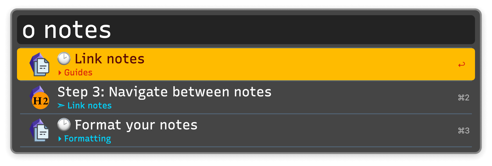
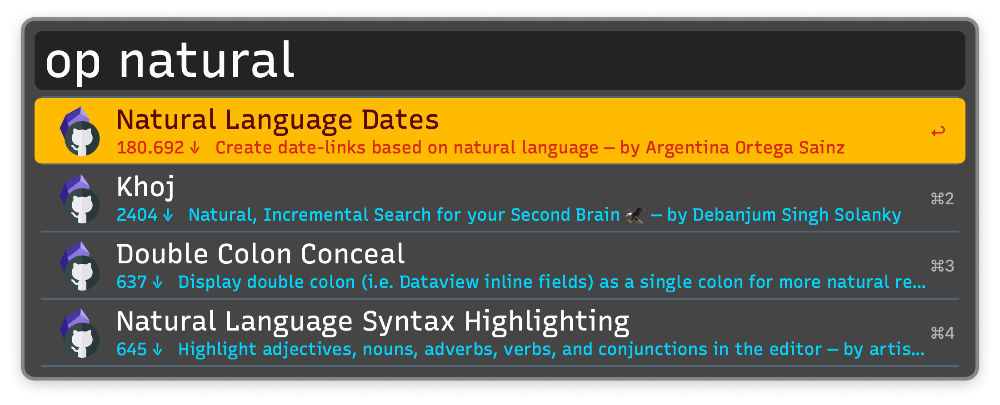
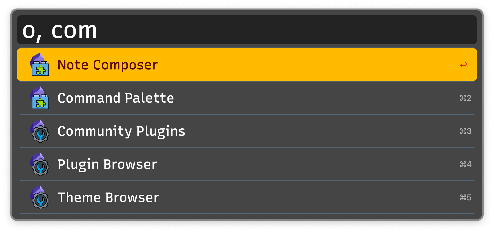
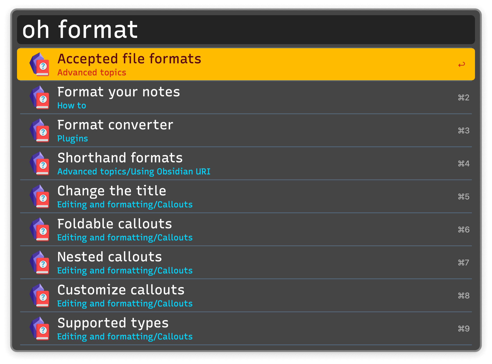

## Setup

Install the [Advanced URI](https://obsidian.md/plugins?id=obsidian-advanced-uri) and [Metadata Extractor](https://obsidian.md/plugins?id=metadata-extractor) Obsidian plugins to the vault you want to set up. Then set your Vault’s location in the Workflow’s Configuration.

In the Obsidian plugin settings for the Metadata Extractor:

* Enable `Write JSON files automatically when Obsidian launches`.
* Set `Configure frequency for writing the three JSON files` to how often you want the Metadata to be updated. A value like 30 minutes is reasonable.
* Do not change any of the other settings.

## Usage

Search your notes, aliases, folders, and headings via the `o` keyword.

* <kbd>↩</kbd> Open in Obsidian.
* <kbd>⌘</kbd><kbd>↩</kbd> Open in a new Obsidian tab (can be configured to open in a new window).
* <kbd>⌥</kbd><kbd>↩</kbd> Reveal in Finder.
* <kbd>⌃</kbd><kbd>↩</kbd> Copy the Obsidian URI as a markdown link.
* <kbd>⇧</kbd><kbd>↩</kbd> Browse a list of all links in the note.
* <kbd>fn</kbd><kbd>↩</kbd> Append text to the note.
* <kbd>⌘</kbd><kbd>Y</kbd> Quick Look the note. May require a Quick Look plugin.

Other search keywords are available:

* `ol` Navigate links in current note.
* `ot` Search tags.
* `os` Search starred files and searches.
* `or` Search recent files.
* `oa` Search for attachments.

The modifiers from the `o` keyword are available, allowing you to traverse your vault.

Create a new note with the `on` keyword. Action with <kbd>⌘</kbd><kbd>↩</kbd> to create it in a new tab.

Search for community plugins and themes with `op`.

* <kbd>↩</kbd> Open on GitHub.
* <kbd>⌘</kbd><kbd>↩</kbd> Open in Obsidian.
* <kbd>⌥</kbd><kbd>↩</kbd> Copy theme URI.
* <kbd>⇧</kbd><kbd>↩</kbd> Search GitHub issues.
* <kbd>⌘</kbd><kbd>Y</kbd> Quick Look theme’s promo screenshot.

Open specific settings tabs with `o,`.

When selecting a plugin, new modifiers are accessible:

* <kbd>↩</kbd> Open in Obsidian.
* <kbd>⌘</kbd><kbd>↩</kbd> Open plugin’s folder in terminal.
* <kbd>⌥</kbd><kbd>↩</kbd> Open plugin’s folder in Finder.
* <kbd>⌃</kbd><kbd>⇧</kbd> Copy plugin ID.
* <kbd>⇧</kbd><kbd>↩</kbd> Enable or disable the plugin.

Search Obsidian’s official documentation with `oh`.

