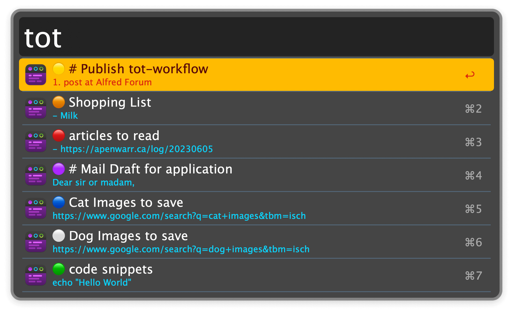

## Usage

Access your Dots via the `tot` keyword.

* <kbd>↩</kbd> Open the Dot.
* <kbd>⌘</kbd><kbd>↩</kbd> Append to the Dot.
* <kbd>⌥</kbd><kbd>↩</kbd> Copy Dot contents.
* <kbd>⌃</kbd><kbd>↩</kbd> Delete the Dot.

Quickly append to a pre-configured Dot via the `qq` keyword or the Hotkey:

* If a browser is frontmost, appends the current browser tab as Markdown link.
* In any other app, appends the selected text.
* If Tot is frontmost, opens all URLs in the current Dot.
