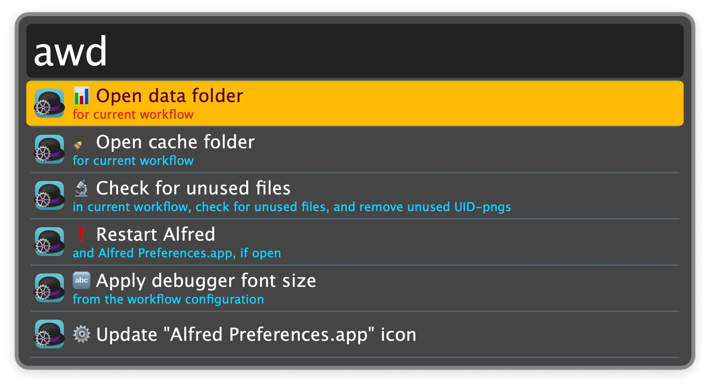
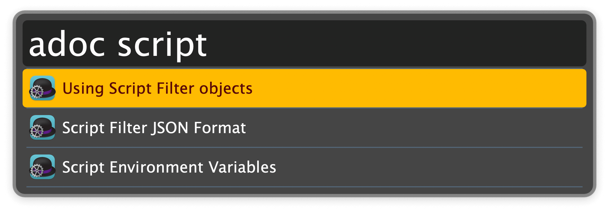

## Usage

Show a menu of workflow utilities via the `awd` keyword.

* <kbd>↩</kbd> Action the selection.

Search workflows documentation via the `adoc` keyword.

* <kbd>↩</kbd> Open web page.
* <kbd>⌥</kbd><kbd>↩</kbd> Copy web page URL.

Access various other actions by configuring the Hotkeys:

* Go to the last workflow in the Alfred Preferences.
* Reload the current workflow, and flush all caches related to it.
* Reveal the current workflow in the Finder.
  * Another hotkey does the opposite and reveals the workflow corresponding to the current Finder window in the Alfred Preferences.
* Copy the workflow absolute path to the clipboard.
* Copy the name of an Alfred workflow variable for the current workflow.
