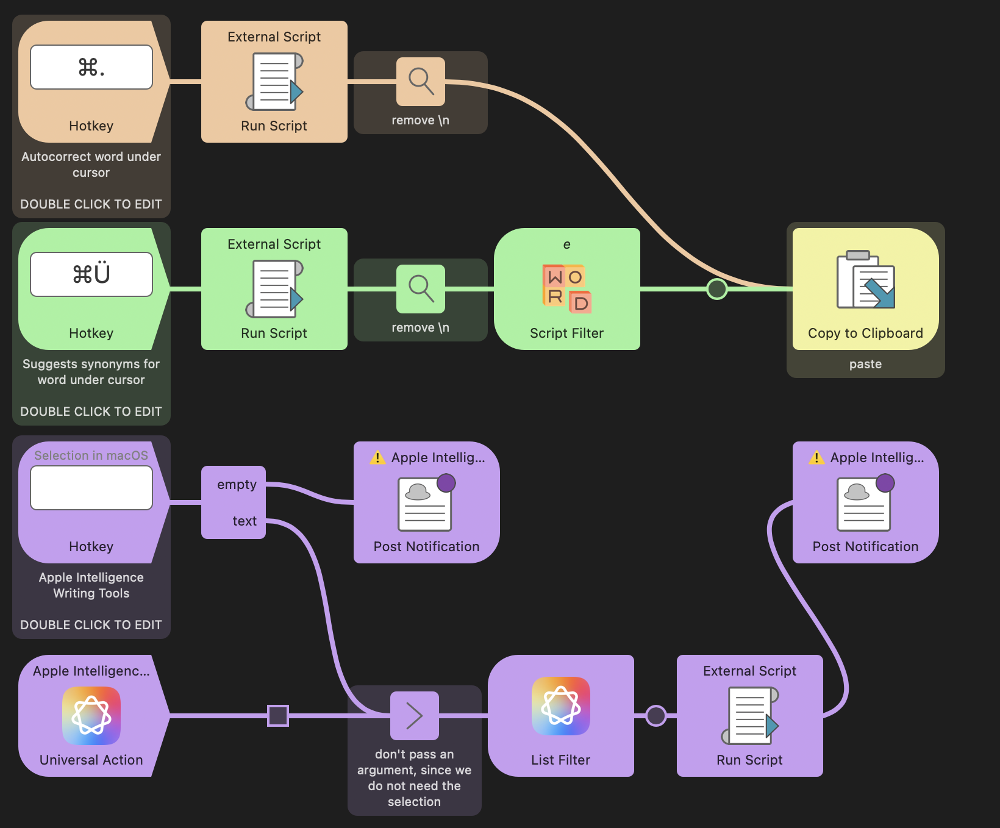

## Setup

Configure the Hotkeys for each action.

Add an OpenAI API key in the Workflow’s Configuration to use the rephrasing feature.

## Usage

Place your cursor in a word or select text then press the defined Hotkeys to:

* Autocorrect the word under the cursor.
* Suggest synonyms for the word under the cursor.
* Rephrase the selected text via ChatGPT ([requires OpenAI API key](https://platform.openai.com/api-keys)). Text can be formatted as:
  * Plain: just output the changed text.
  * Markdown: Additions are displayed as highlights, deletions are displayed as strikethroughs.
  * [Critic Markup](https://github.com/CriticMarkup/CriticMarkup-toolkit).
* Invoke Apple Intelligence Writing Tools.

