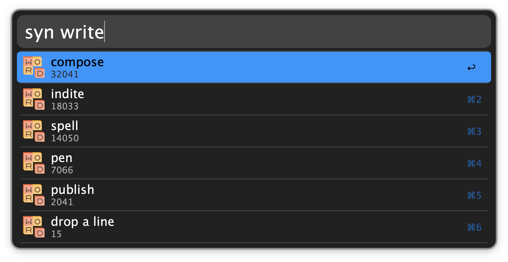

## Setup

Configure the Hotkeys for each action.

## Usage

Place your cursor in a word or select text then press the defined Hotkeys to:

* Autocorrect the word under the cursor.
* Suggest synonyms for the word under the cursor.
* Invoke Apple Intelligence Writing Tools.

You can also trigger the synonym suggestion with the keyword `syn`:

