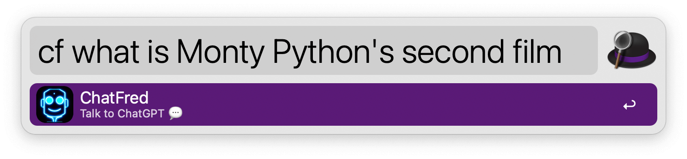
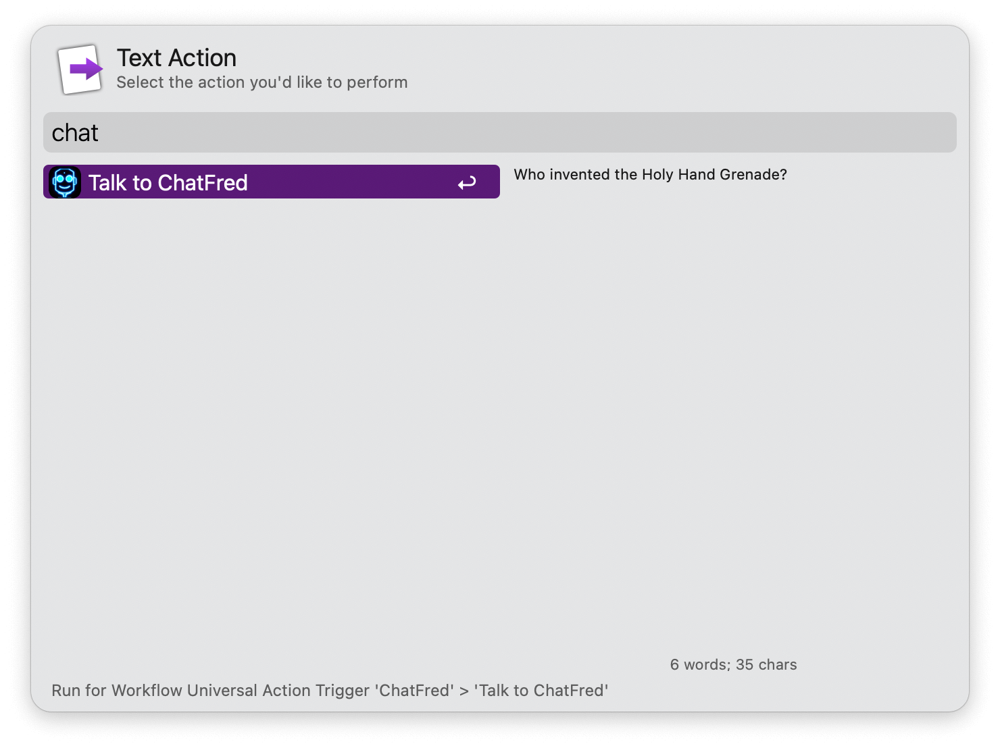
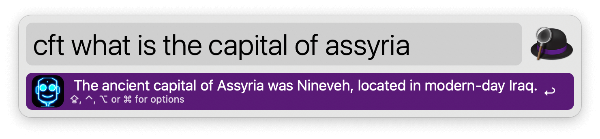
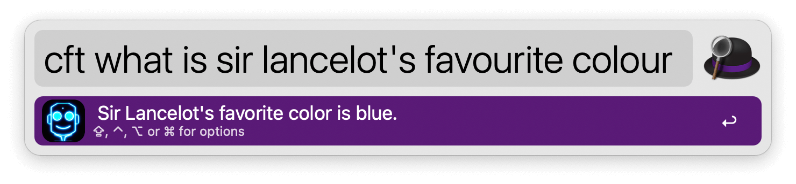
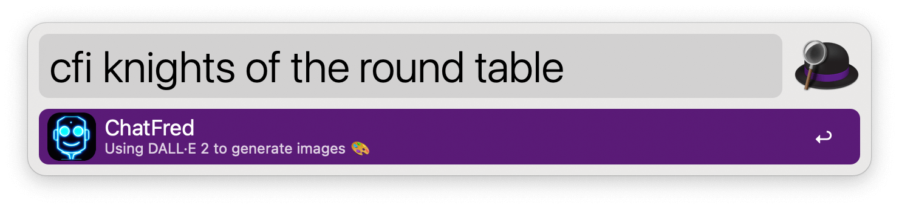

## Usage

Talk with ChatGPT via the `cf` keyword. Answers will show as Large Type.

<kbd>↩</kbd>: Send prompt.
<kbd>⌘</kbd><kbd>↩</kbd>: Talk to unlocked ChatGPT.
<kbd>⌥</kbd><kbd>↩</kbd>: Save prompt for later.

Alternatively, use the Universal Action, Fallback Search, or Hotkey.

To generate text with InstructGPT models and see results in-line, use the `cft` keyword.

* <kbd>↩</kbd> Nothing by default. Set one or more actions in the Workflow’s Configuration.
* <kbd>⌘</kbd><kbd>↩</kbd> Show reply in Large Type.
* <kbd>⌥</kbd><kbd>↩</kbd> Speak reply.
* <kbd>⇧</kbd><kbd>↩</kbd> Save conversation to file.
* <kbd>⌃</kbd><kbd>↩</kbd> Copy reply to clipboard.

Generate images with [DALL·E 2](https://openai.com/dall-e-2/) via the `cfi` keyword.

