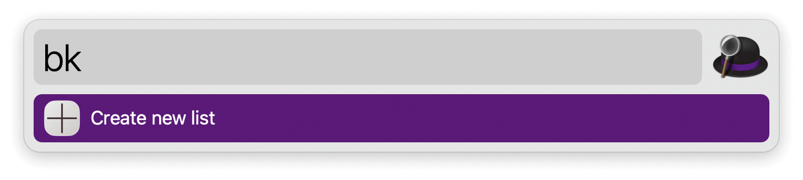
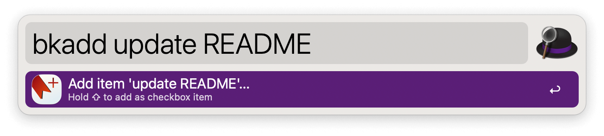
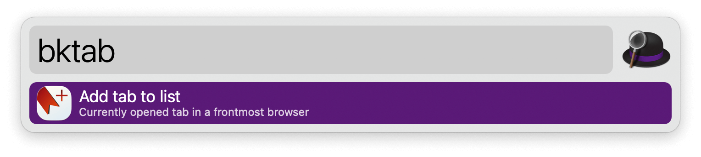
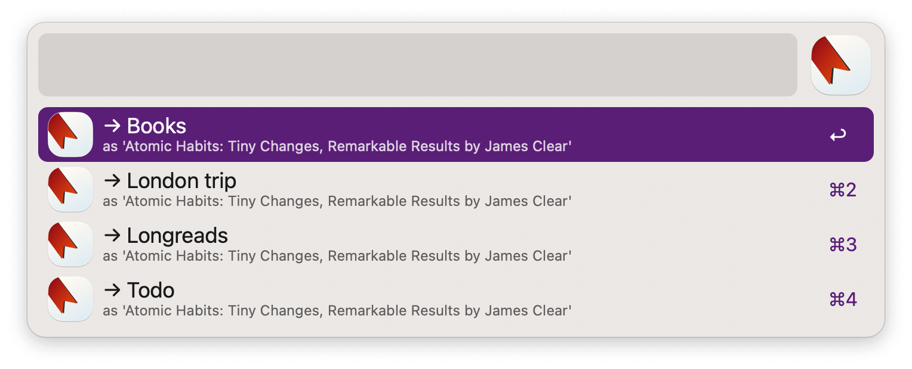
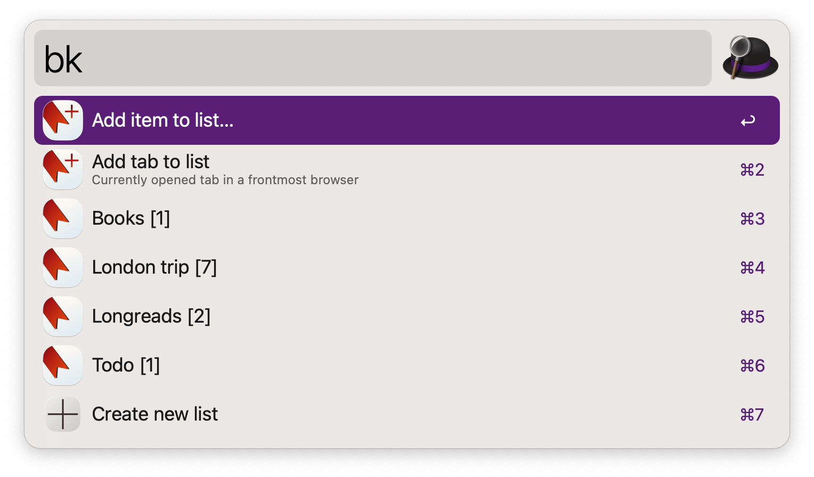
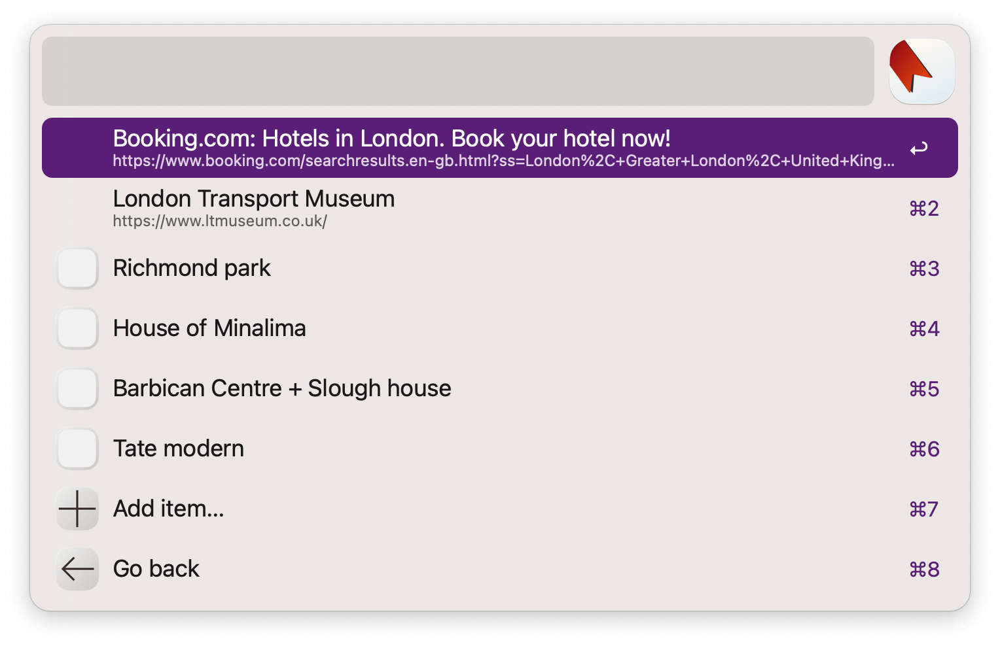

## Setup

Set a folder to save your lists in the Workflow’s Configuration.

Create a new list via the `bk` keyword.

## Usage

Add items to one of your lists via the `bkadd` keyword, or add the frontmost browser tab with `bktab`.

View your lists via the `bk` keyword.

* <kbd>↩︎</kbd> Open list.
* <kbd>⌘</kbd><kbd>↩︎</kbd> Open list file in text editor.
* <kbd>⇧</kbd><kbd>↩︎</kbd> Show checked items.
* <kbd>⌘</kbd><kbd>⇧</kbd> Open all items of the list (excluding checked items).
* <kbd>⌘</kbd><kbd>⌥</kbd><kbd>⇧</kbd><kbd>↩︎</kbd> Delete list.

* <kbd>↩︎</kbd> Open list item. URLs are opened in the browser and plain text is used in web search.
* <kbd>⇧</kbd><kbd>↩︎</kbd> Convert item to checkbox or plain item.
* <kbd>⌘</kbd><kbd>⇧</kbd><kbd>↩︎</kbd> Check or uncheck checkbox item.
* <kbd>⌘</kbd><kbd>⌥</kbd><kbd>⇧</kbd><kbd>↩︎</kbd> Delete item.
