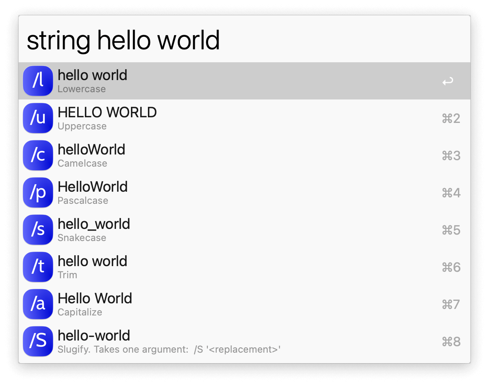
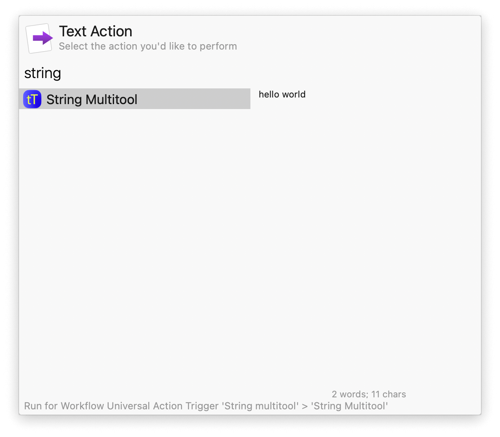

## Usage

Convert text into upper case, lower case, camel case, and other formats via the `string` keyword.

* <kbd>↩</kbd> Copy to clipboard.
* <kbd>⌘</kbd><kbd>↩</kbd> Paste to frontmost app.

Alternatively, send text for processing with the Universal Action.

End your string with a forward slash and a letter to filter a specific transformation or chain them together: `/l` converts to lower case and `/c` to camel case, so `/lc` does both in that order.

Slugify (`/S`) defaults to `-` between characters but takes an optional alternative character between quotes.

Replace (`/R`) takes two strings of text between quotes to replace the first with the second.

