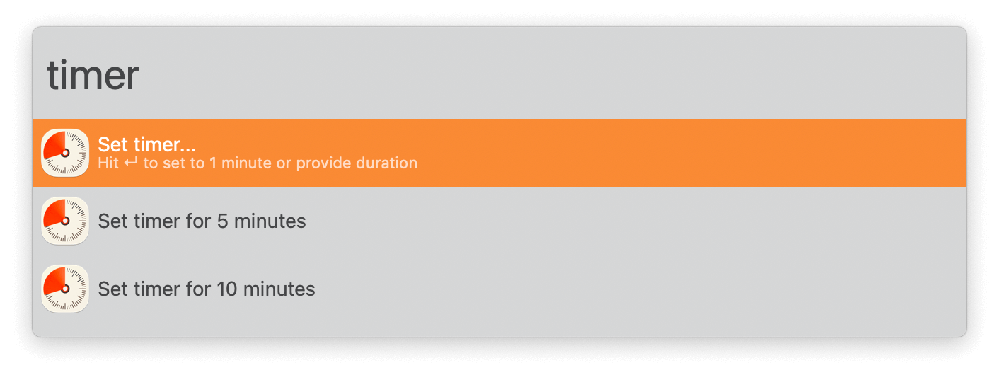
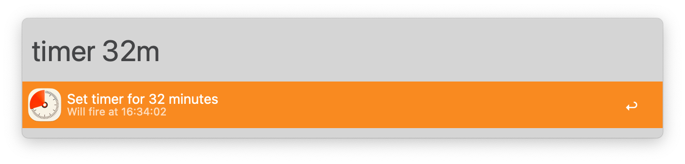
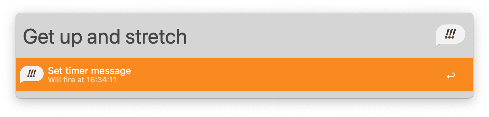
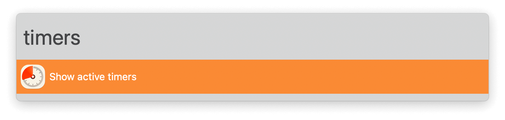
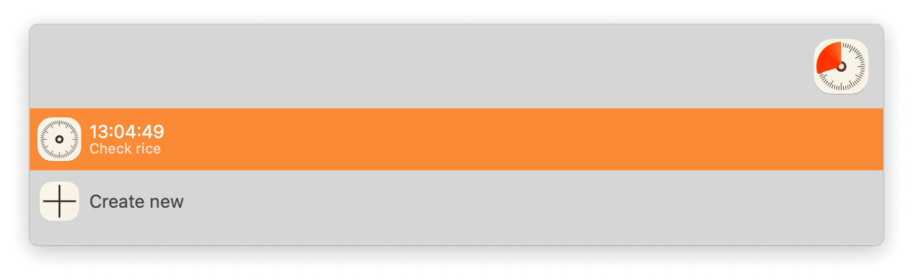
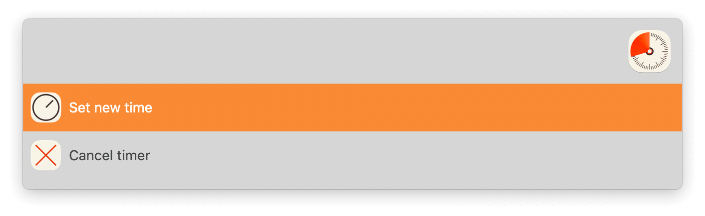
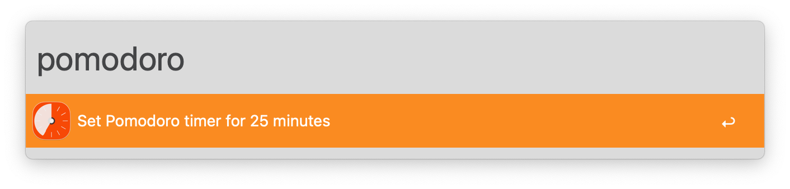

## Usage

Set timers via the `timer` keyword. Configure presets in the Workflow’s Configuration or pick a duration on demand. A Large Type message will show when done.

By default you’re asked for a timer message but you can skip it with <kbd>⌘</kbd><kbd>↩</kbd>.

See a list of running timers with the `timers` keyword.

Press <kbd>↩</kbd> to edit or cancel it.

Set a configurable pomodoro timer via the `pomodoro` keyword.

Start a sequence of repeating timers via the `intervals` keyword.

