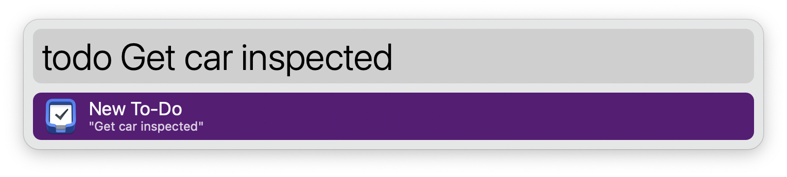

## Usage

Add to-dos to Things 3 via the `todo` keyword.



In addition to a to-do title, you can use special syntax to add tags, a due date, and more:

```
title #tag1 #tag2 [project name/area name] ::note >duedate
```
