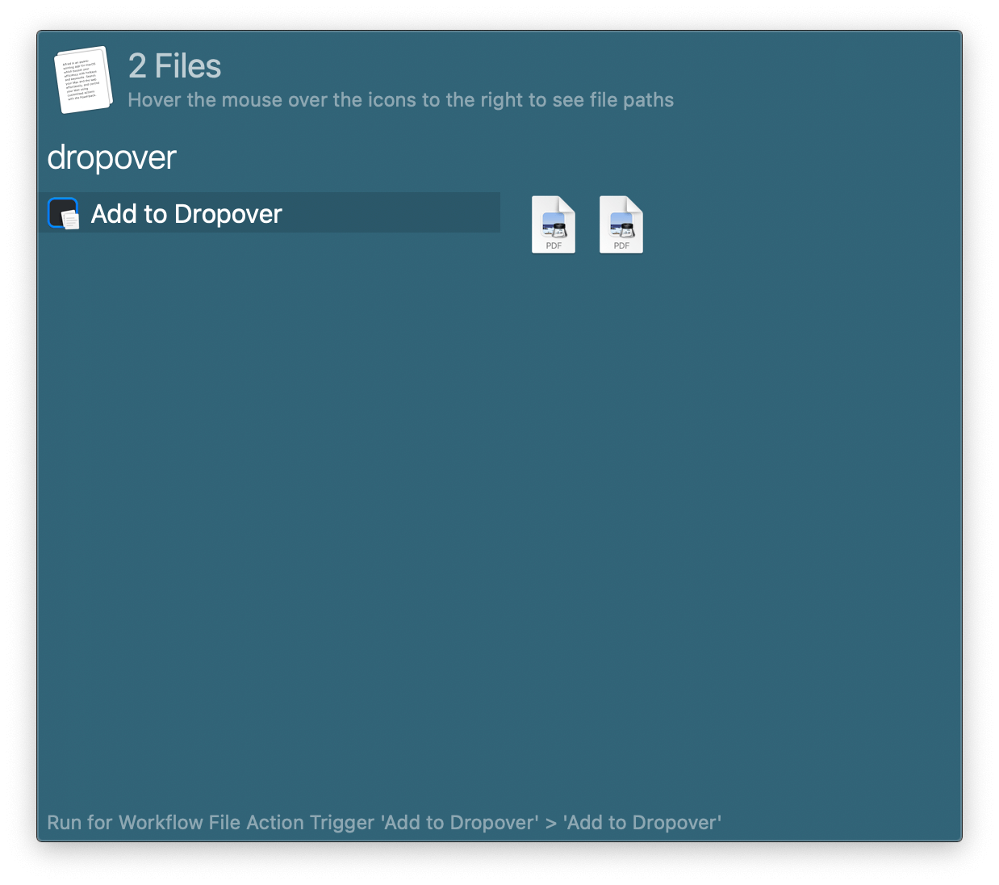

## Setup

Install the workflow from the Dropover app.

In the menubar: `Dropover` → `Settings…` → `Third Party Extensions` → `Install Alfred Workflow…`.

## Usage

Add files to a new Dropover shelf via the Universal Action.

