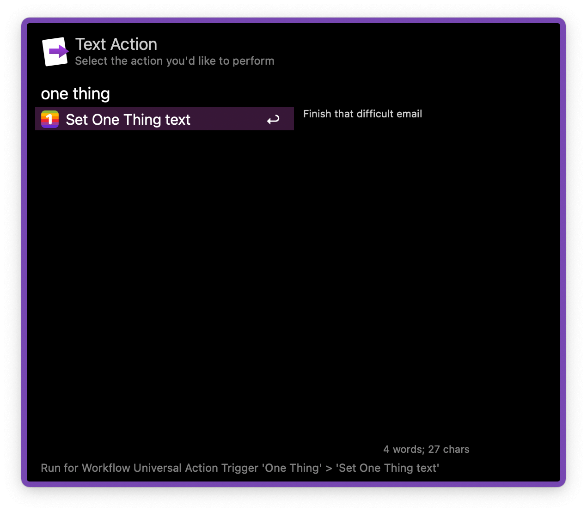

## Usage

Change the message set by the [One Thing](https://sindresorhus.com/one-thing) app on the menubar via the `one` keyword.

<kbd>↩</kbd> Set One Thing text.
<kbd>⌘</kbd><kbd>↩</kbd> Clear One Thing text.
<kbd>⌃</kbd><kbd>↩</kbd> Copy One Thing text.

Alternatively, set the message via the Universal Action.

