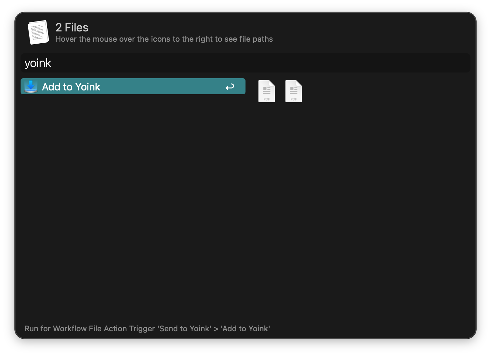

## Setup

Install the workflow from the Yoink app.

In the menubar: `Yoink` → `Settings…` → `Extensions` → `Install Alfred File Action`.

## Usage

Send files to Yoink via the [Universal Action](https://www.alfredapp.com/help/features/universal-actions/).

