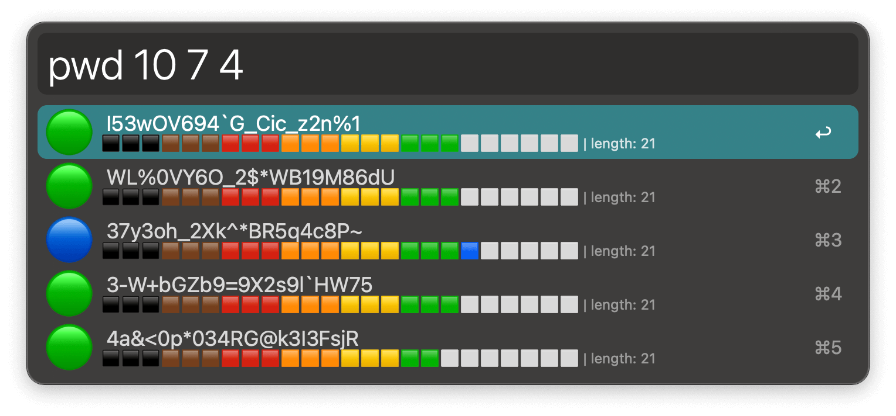

## Usage

Generate structured passwords via the `pwd` keyword.

Passwords will be 25 characters in length by default: 15 letters, 5 digits, 5 symbols. Modify these values on-the-fly by typing them in order.

