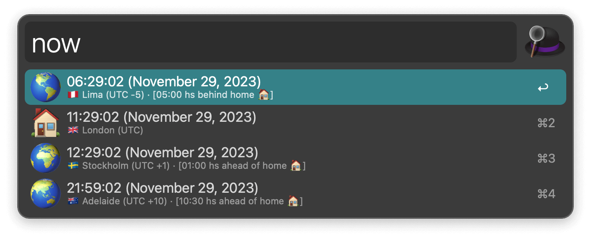
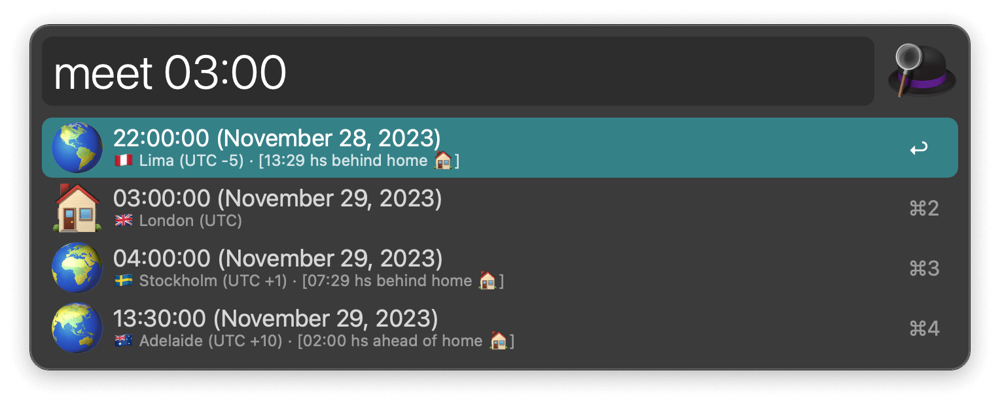
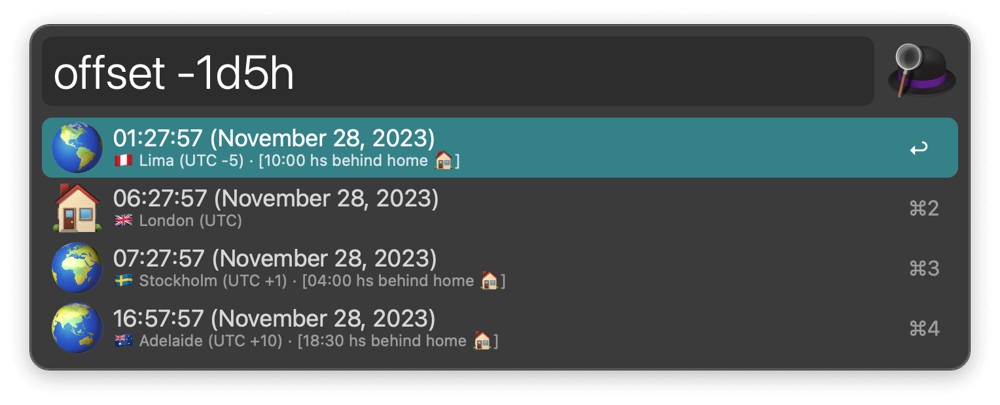

## Usage

View the current time in different timezones via the `now` keyword.

Check a specific date with the `meet` keyword or a relative time with the `offset` keyword.

Change the timezones to list in the Workflow’s Configuration.
