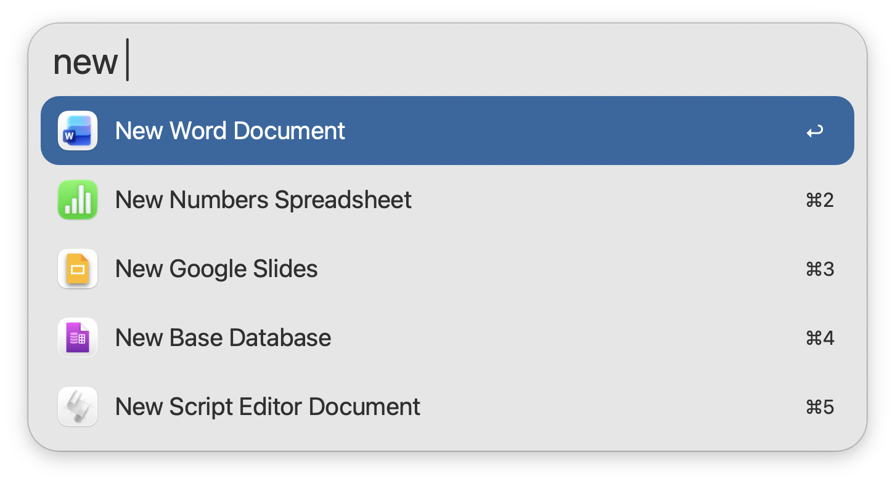
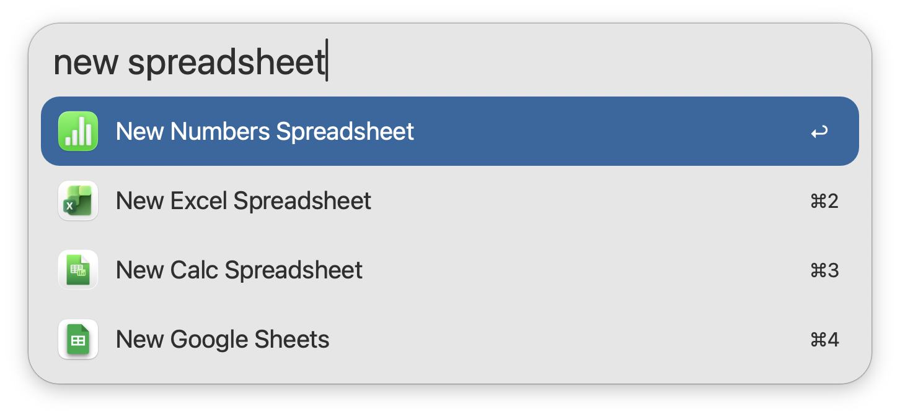
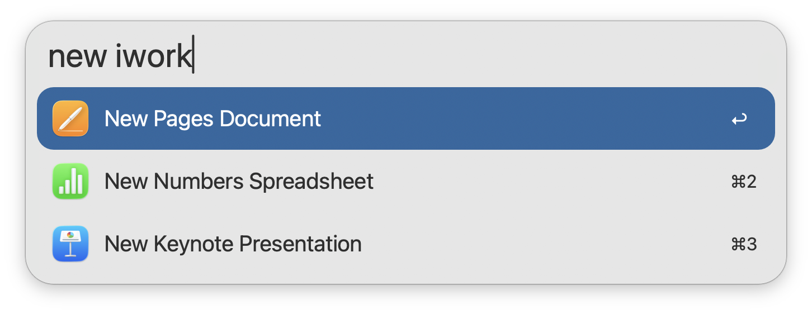
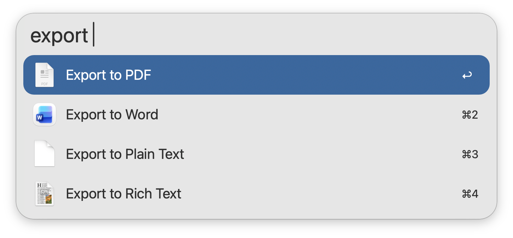

## Usage

Open applications directly to a new file via the `new` keyword.

Type to filter. Results are searchable by Name, Document Type, and Office Suite.

Export iWork and Microsoft 365 documents to a new format via the `export` keyword. Documents must occupy the frontmost window of your screen.

Configure the Hotkeys as a shortcut for triggering the above actions.