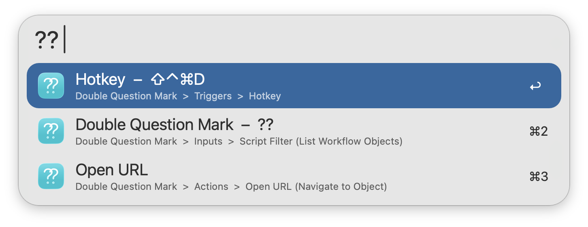

## Usage

Search for workflow objects via the `??` keyword. Type to filter by Object Type, Category, Hotkey, Keyword, Note, Title, Subtext, Script File, or by Workflow Name.

* <kbd>↩</kbd> Navigate to Workflow Object.

Configure the Hotkey as a faster shortcut for searching Workflow Objects.
