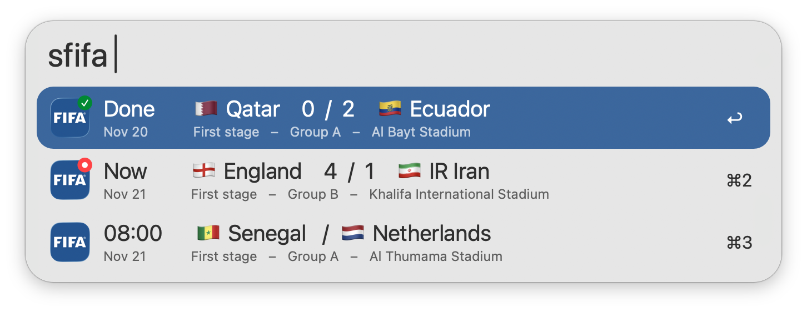
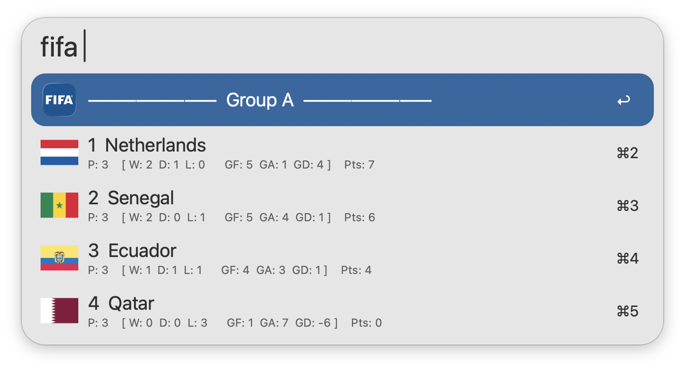
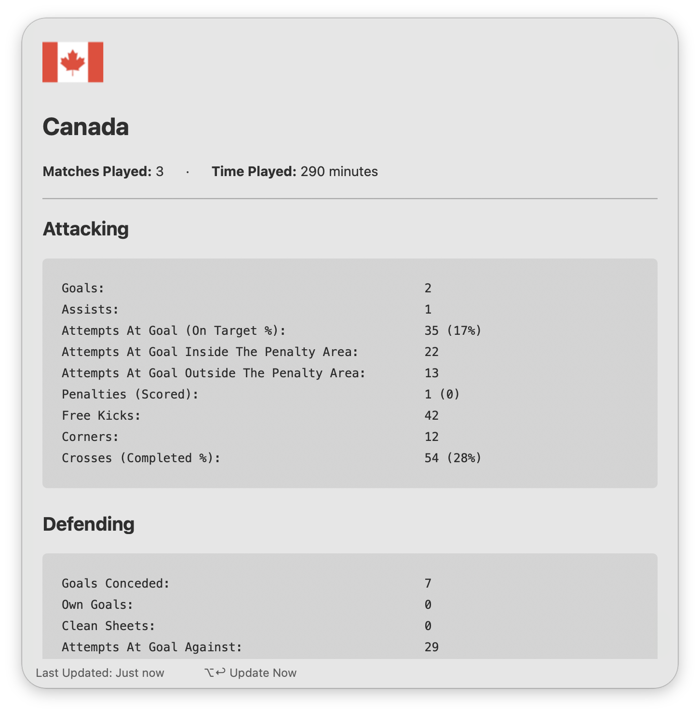
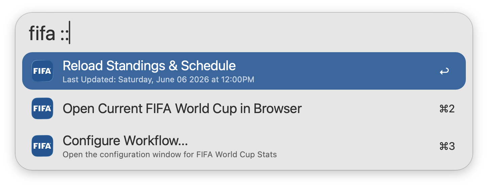

## Usage

View the current [FIFA World Cup](https://www.fifa.com/worldcup) schedule via the `sfifa` keyword, adjusted to your local time zone. Type to filter by Country, Group, Stadium/City, Stage/Knockout, Date, or Favourite.

* <kbd>↩</kbd> Open Match in Browser.
* <kbd>⌥</kbd><kbd>↩</kbd> Show/Hide Old Matches.
* <kbd>⌃</kbd><kbd>↩</kbd> Show/Hide Spoilers.

Use the `fifa` keyword to view the current World Cup Standings. Type to filter by Country, Position, or Group.

* <kbd>↩</kbd> View Team Stats in Alfred.
* <kbd>⇧</kbd><kbd>⌘</kbd><kbd>↩</kbd> Set/Unset Favourite Team.

Additional Team Stats can be viewed directly within Alfred. This includes Attacking, Defending, Possession, and Disciplinary Stats.

* <kbd>⌥</kbd><kbd>↩</kbd> Refresh Team Stats.

Append `::` to the configured Keywords to access other actions, such as manually reloading the Standings & Schedule cache.

Configure the Hotkeys as shortcuts for viewing the standings and schedule.