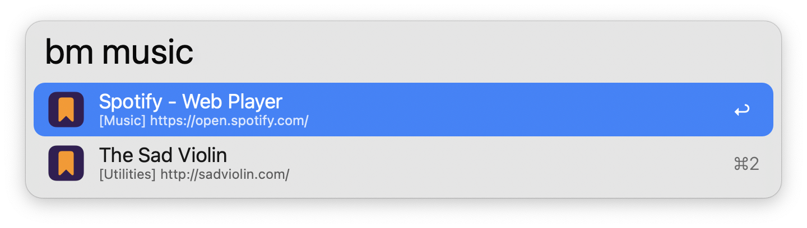
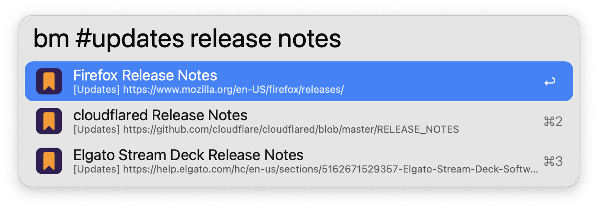
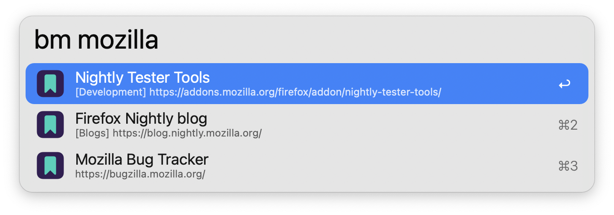
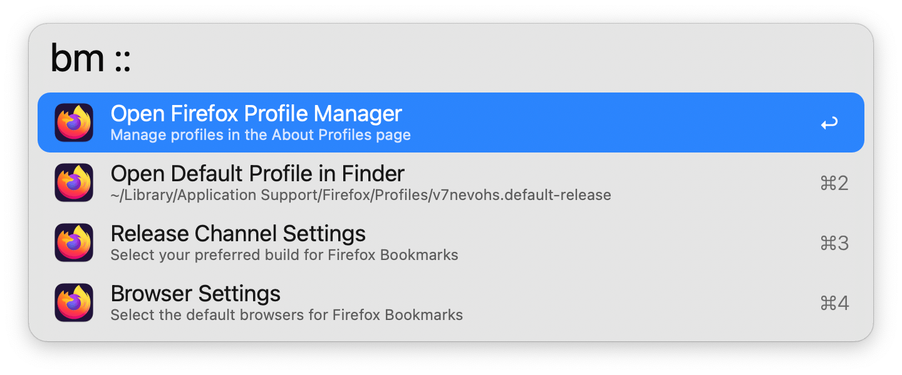

## Usage

Search your [Firefox](https://www.mozilla.org/firefox/new) bookmarks via the `bm` keyword.

Type to refine your search. Bookmarks are always filtered by Name, while filtering by URL, Tags, Keyword, and bookmark description are configurable from the Workflow’s Configuration.

* <kbd>↩</kbd> Open bookmark in primary browser.
* <kbd>⇧</kbd><kbd>⌘</kbd><kbd>↩</kbd> Open in primary browser without closing Alfred (when browser is in focus).
* <kbd>⌘</kbd><kbd>↩</kbd> Open bookmark in secondary browser.
* <kbd>⌘</kbd><kbd>C</kbd> Copy bookmark URL.
* <kbd>⌘</kbd><kbd>L</kbd> View all tags and full URL in Large Type.
* <kbd>⇧</kbd> Show bookmark description.

Firefox Developer Edition and Nightly builds are also supported and configurable. The Workflow's icon colours and bookmarks will change based on the selected Release Channel.

Append `::` to the configured keyword to access other actions, including opening the [Firefox Profile Manager](https://support.mozilla.org/kb/profile-manager-create-remove-switch-firefox-profiles). Bookmarks are only indexed from the default profile, which can be changed from the Profile Manager in each Firefox build.

Configure the Hotkey as a shortcut to search for your bookmarks.

Bookmarks with the tag `Exclude-Alfred` will be hidden from search. This tag is case sensitive.
