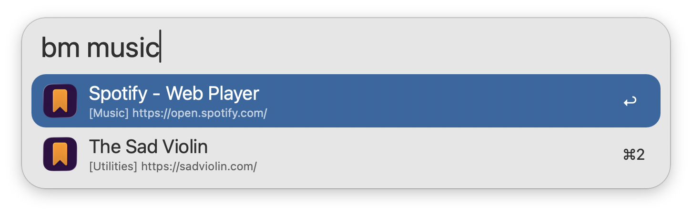
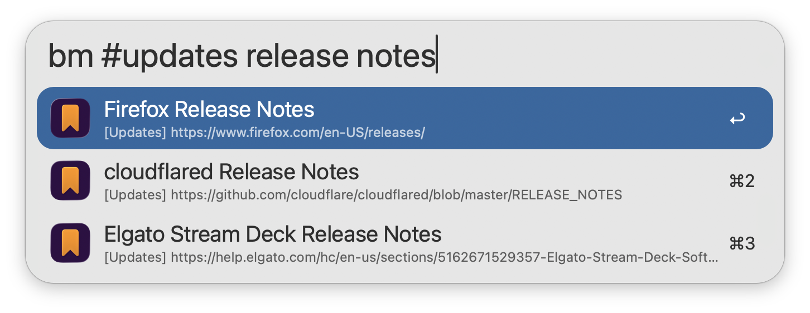
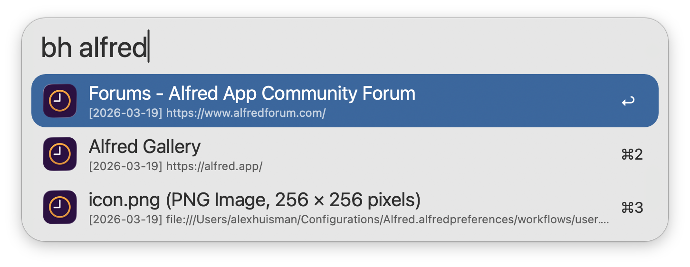
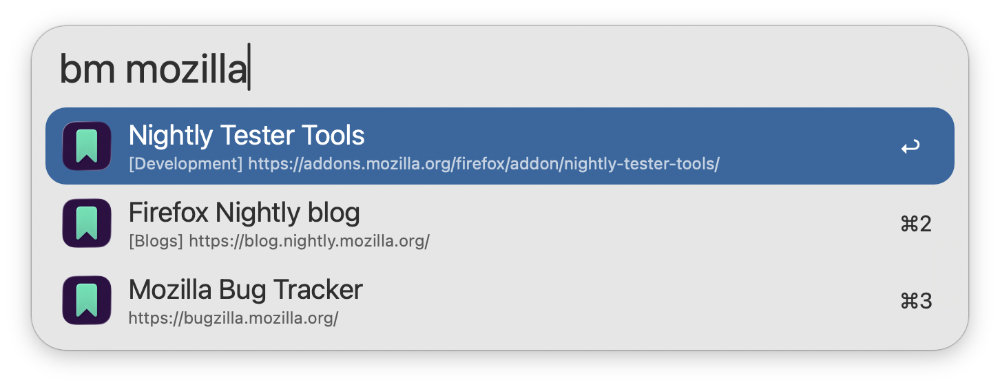
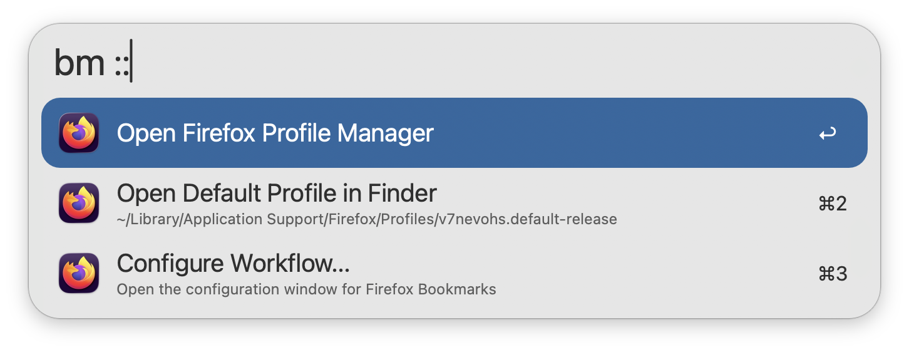

## Usage

Search for your [Firefox](https://www.mozilla.org/firefox/new) bookmarks via the `bm` keyword. Type to refine your search.

Bookmarks are always searchable by Name, while filtering by Description, Keyword, URL, and Tag is configurable from the Workflow’s Configuration.

* <kbd>↩</kbd> Open bookmark in primary browser.
* <kbd>⇧</kbd><kbd>⌘</kbd><kbd>↩</kbd> Open in primary browser without closing Alfred.
* <kbd>⌘</kbd><kbd>↩</kbd> Open bookmark in secondary browser.
* <kbd>⌘</kbd><kbd>L</kbd> View all tags and full URL in Large Type.
* <kbd>⇧</kbd> Hold to show bookmark description.

Search your Firefox history via the `bh` keyword. History entries are searchable by Name and URL.

* <kbd>↩</kbd> Open entry in primary browser.
* <kbd>⇧</kbd><kbd>⌘</kbd><kbd>↩</kbd> Open in primary browser without closing Alfred.
* <kbd>⌘</kbd><kbd>↩</kbd> Open entry in secondary browser.
* <kbd>⌘</kbd><kbd>L</kbd> View full Date and URL in Large Type.

Firefox Developer Edition and Nightly builds are also supported. The Workflow's icon colours, bookmarks, and history will change based on the [configured](https://www.alfredapp.com/help/workflows/user-configuration/) Release Channel.

Append `::` to the configured Keyword to access other actions, including opening the [Firefox Profile Manager](https://support.mozilla.org/kb/profile-manager-create-remove-switch-firefox-profiles). Bookmarks and history are only indexed from the default profile, which can be changed from the Profile Manager in each Firefox build.

Configure the Hotkeys as shortcuts for searching your bookmarks and history.

Bookmarks with the tag `Exclude-Alfred` will be hidden from search. This tag is case sensitive.
