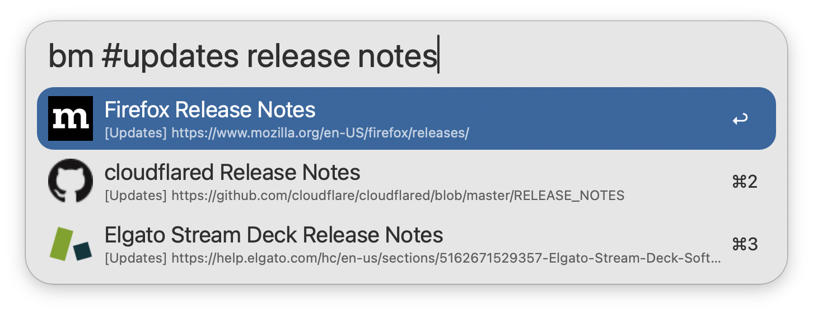

## Setup

Set the Base URL and API Token of your [linkding](https://linkding.link/) installation in the Workflow’s Configuration. You can find the API Token from your linkding Settings → Integrations → REST API.

## Usage

Search for your [linkding](https://linkding.link/) bookmarks via the `bm` keyword. Type to refine your search.

Bookmarks are always searchable by title, while filtering by Description, Notes, URL, and Tag is configurable from the Workflow’s Configuration.

* <kbd>↩</kbd> Open bookmark in primary browser.
* <kbd>⇧</kbd><kbd>⌘</kbd><kbd>↩</kbd> Open in primary browser without closing Alfred.
* <kbd>⌘</kbd><kbd>↩</kbd> Open bookmark in secondary browser.
* <kbd>⌥</kbd><kbd>↩</kbd> Edit bookmark in linkding.
* <kbd>⇧</kbd><kbd>⌥</kbd><kbd>↩</kbd> View bookmark in linkding.
* <kbd>⌃</kbd><kbd>↩</kbd> Delete bookmark from linkding.
* <kbd>⌘</kbd><kbd>L</kbd> View all tags and full URL in Large Type.
* <kbd>⇧</kbd> Hold to show bookmark description.

Append `::` to the configured Keyword to access other actions, such as manually reloading the bookmark cache.

Favicons are supported, and must be enabled in both the Workflow’s Configuration and your linkding settings.

Configure the Hotkey as a shortcut for searching your bookmarks. Use the Universal Action to bookmark URLs from Alfred’s Clipboard History or selected text.

Bookmarks with the tag `Exclude-Alfred` will be hidden from search. This tag is case sensitive.
