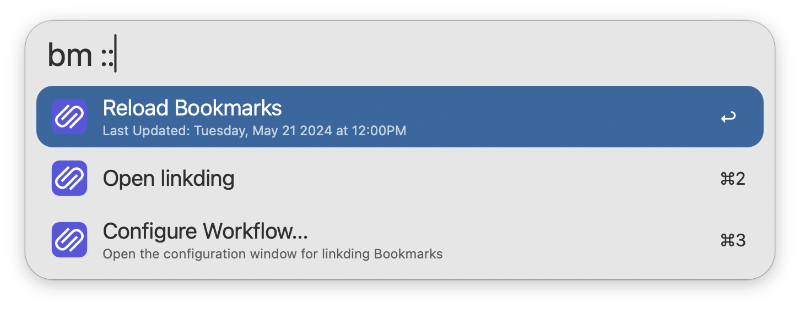

## Setup

Set the Base URL and API Token of your [linkding](https://github.com/sissbruecker/linkding) installation in the Workflow’s Configuration. You can find the API Token from your linkding Settings → Integrations → REST API.

## Usage

Search for your [linkding](https://github.com/sissbruecker/linkding) bookmarks via the `bm` keyword.

Type to refine your search. Bookmarks are always filtered by title, while filtering by description, URL, and tags is configurable from the Workflow’s Configuration.

* <kbd>↩</kbd> Open bookmark in primary browser.
* <kbd>⌘</kbd><kbd>⇧</kbd><kbd>↩</kbd> Open in primary browser without closing Alfred (when browser is in focus).
* <kbd>⌘</kbd><kbd>↩</kbd> Open bookmark in secondary browser.
* <kbd>⌥</kbd><kbd>↩</kbd> Edit bookmark in linkding.
* <kbd>⇧</kbd><kbd>⌥</kbd><kbd>↩</kbd> View bookmark in linkding.
* <kbd>⌃</kbd><kbd>↩</kbd> Delete bookmark from linkding.
* <kbd>⌘</kbd><kbd>C</kbd> Copy bookmark URL.
* <kbd>⇧</kbd> Show bookmark description.

Append `::` to the configured keyword to access other actions, including manually reloading the bookmark cache.

Enable bookmark auto-updates from the Workflow’s Configuration.

Favicons are also supported, and must be enabled in both the Workflow’s Configuration and your linkding settings (this requires at least linkding version `1.31.1`).

Configure the Hotkey as a shortcut to search for your bookmarks. Use the Universal Action to bookmark URLs from Alfred’s Clipboard History or selected text.

Bookmarks with the tag `Exclude-Alfred` will be hidden from search. This tag is case sensitive.
