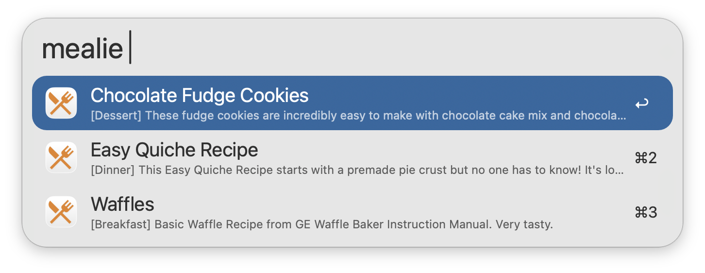
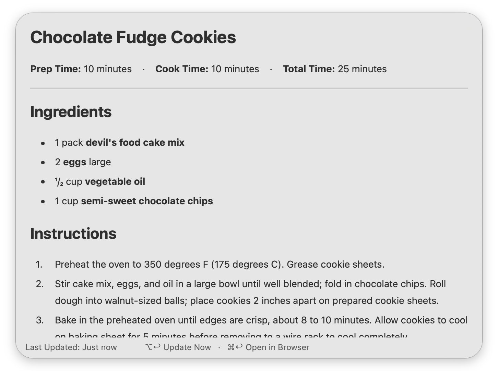
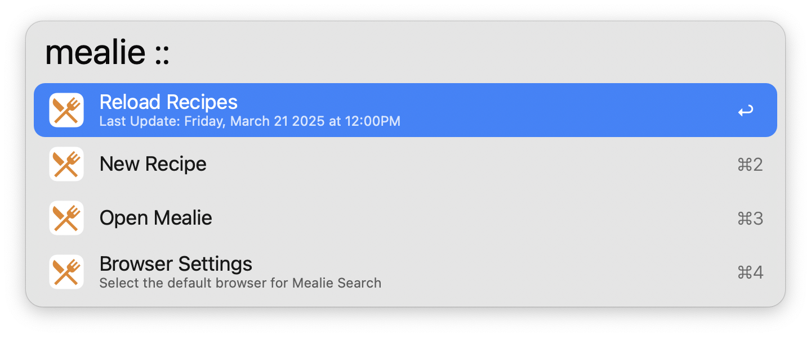
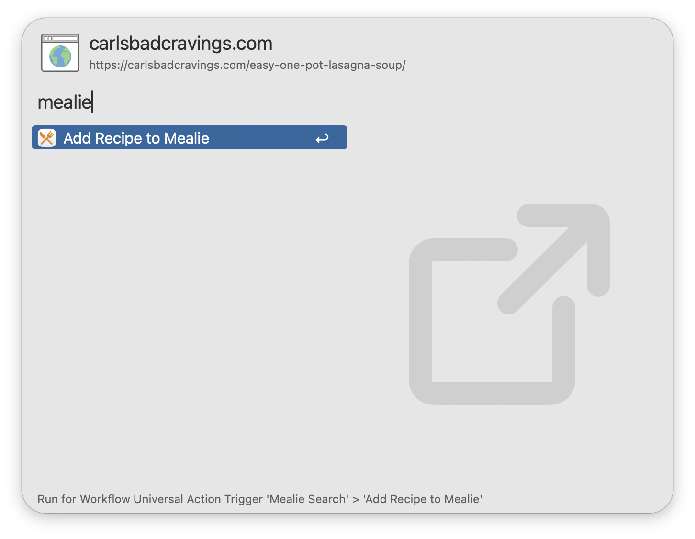

## Setup

Set the Base URL and API Token of your [Mealie](https://docs.mealie.io/) installation in the Workflow’s Configuration. You can generate an API Token from your Mealie user profile under API Tokens.

## Usage

Search for your [Mealie](https://mealie.io/) recipes via the `mealie` keyword.

Type to refine your search. Recipes are always searchable by Title, while filtering by Description, Categories, Tags, and Tools is configurable from the Workflow’s Configuration.

* <kbd>↩</kbd> Open recipe in Alfred.
* <kbd>⌘</kbd><kbd>↩</kbd> Open recipe in browser.
* <kbd>⌃</kbd><kbd>↩</kbd> Delete recipe from Mealie.

Recipes can be viewed directly within Alfred. This includes a list of Prep Times, Ingredients, Required Tools, Step-by-Step Instructions, and Notes.

* <kbd>⌘</kbd><kbd>↩</kbd> Open recipe in browser.
* <kbd>⌥</kbd><kbd>↩</kbd> Refresh recipe data.

Append `::` to the configured Keyword to access other actions, including manually reloading the recipes cache.

Configure the Hotkey as a shortcut for searching your recipes. Use the Universal Action to import URLs into Mealie from Alfred’s Clipboard History or selected text.

