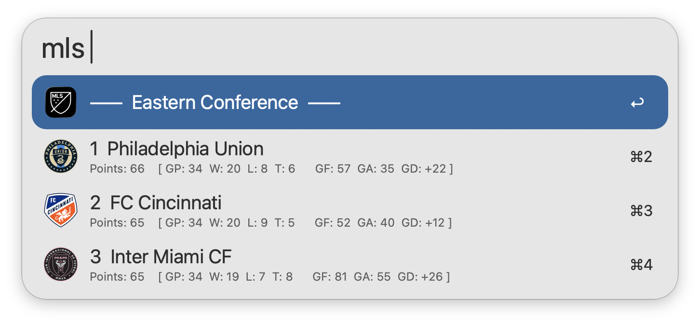
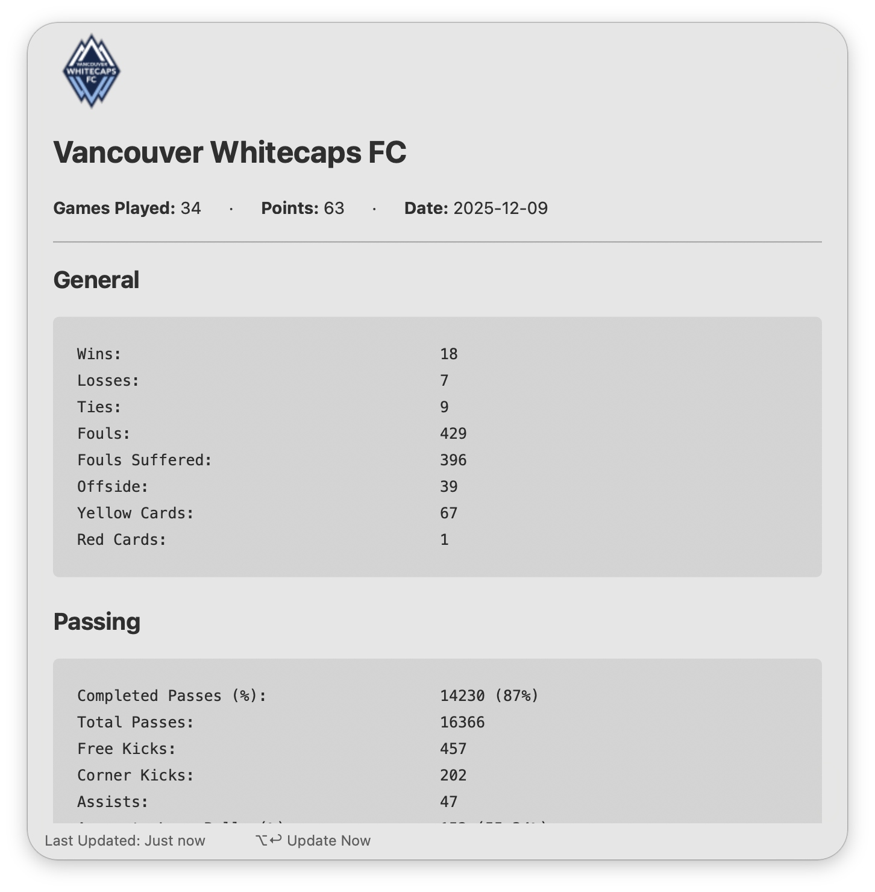
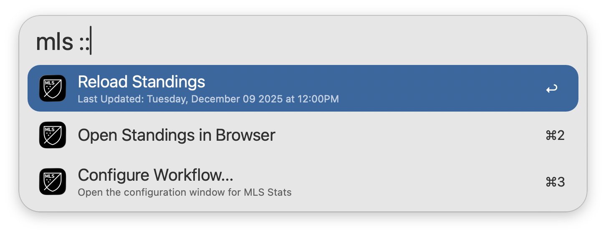

## Usage

View the latest [MLS](https://www.mlssoccer.com) standings via the `mls` keyword. Type to filter by Team, Ranking, or Conference.

* <kbd>↩</kbd> View Team Stats.
* <kbd>⌥</kbd><kbd>↩</kbd> Rank teams by Conference.
* <kbd>⌃</kbd><kbd>↩</kbd> Rank teams by League.

Additional Team Stats can be viewed directly within Alfred. This includes General, Passing, Attacking, and Defending Stats.

* <kbd>⌥</kbd><kbd>↩</kbd> Refresh Team Stats.

Append `::` to the configured Keyword to access other actions, such as manually reloading the standings cache.

Configure the Hotkey as a shortcut for viewing standings.