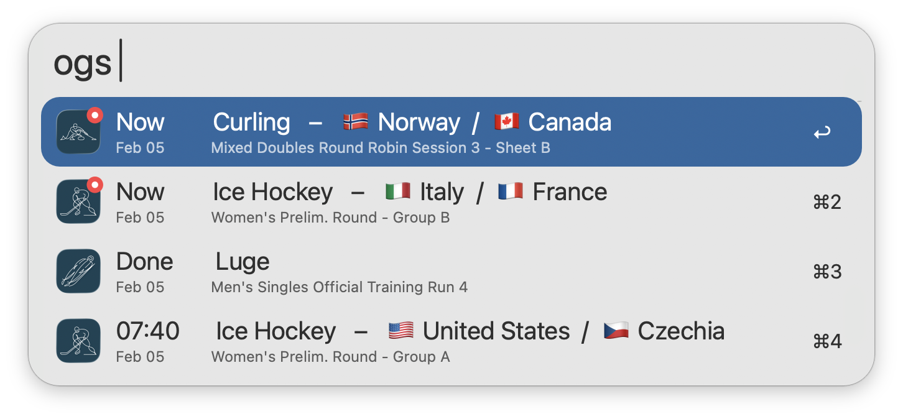
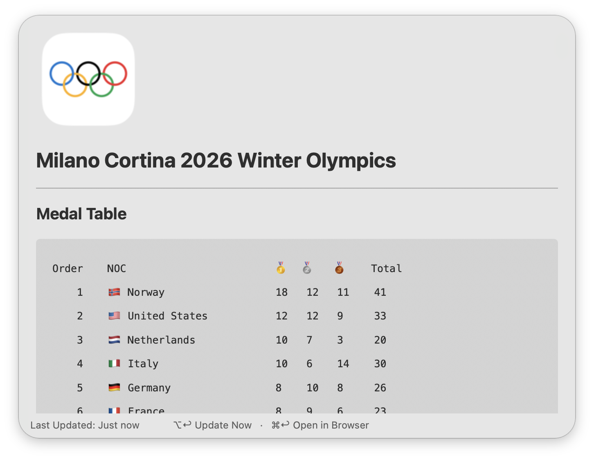
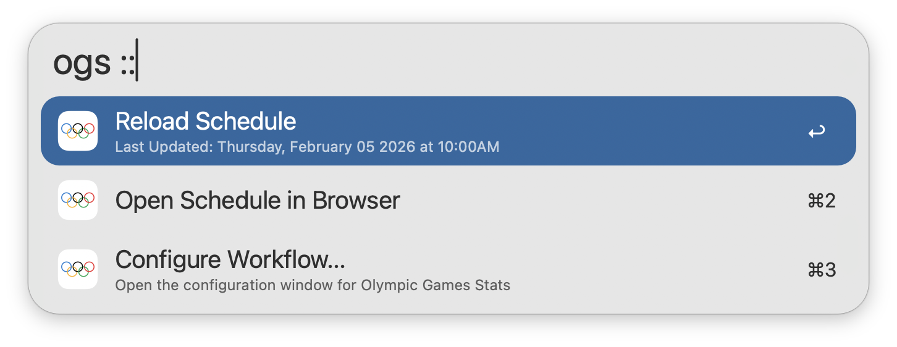

## Usage

View the current [Olympic](https://www.olympics.com/) and [Paralympic](https://www.paralympic.org/) schedules via the `ogs` and `pgs` keywords, adjusted to your local time zone. Type to filter by Sport, Country, Event, Medal Event, or Date.

* <kbd>↩</kbd> Open event details in browser.
* <kbd>⌥</kbd><kbd>↩</kbd> Show/Hide old events.

Use the `ogm` keyword to view the Olympic and Paralympic Medal Tables.

* <kbd>⌘</kbd><kbd>↩</kbd> Open in Browser.
* <kbd>⌥</kbd><kbd>↩</kbd> Refresh Medal Table.

Append `::` to the configured [Keywords](https://www.alfredapp.com/help/workflows/inputs/keyword) to access other actions, such as manually reloading the schedule cache.

Configure the [Hotkeys](https://www.alfredapp.com/help/workflows/triggers/hotkey/) as shortcuts for viewing the schedules and medal tables.