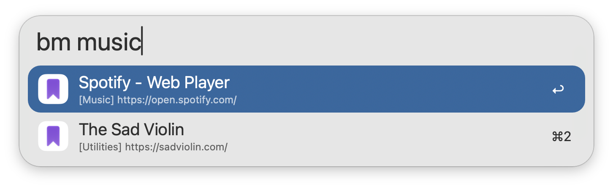
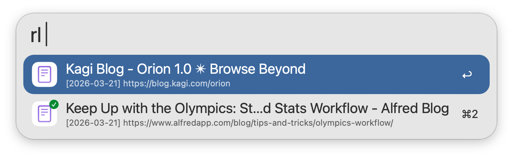

## Usage

Search for your [Orion](https://orionbrowser.com) bookmarks via the `bm` keyword. Type to refine your search.

Bookmarks are always searchable by Name, while filtering by Folder, Keyword, and URL is configurable from the Workflow’s Configuration.

* <kbd>↩</kbd> Open bookmark in primary browser.
* <kbd>⇧</kbd><kbd>⌘</kbd><kbd>↩</kbd> Open in primary browser without closing Alfred.
* <kbd>⌘</kbd><kbd>↩</kbd> Open bookmark in secondary browser.
* <kbd>⌘</kbd><kbd>L</kbd> View Folder and full URL in Large Type.

Search your Orion History and Reading List via the `bh` and `rl` keywords respectively. History and Reading List entries are searchable by Name and URL. Reading List entries are also searchable by Read/Unread status.

* <kbd>↩</kbd> Open entry in primary browser.
* <kbd>⇧</kbd><kbd>⌘</kbd><kbd>↩</kbd> Open in primary browser without closing Alfred.
* <kbd>⌘</kbd><kbd>↩</kbd> Open entry in secondary browser.
* <kbd>⌘</kbd><kbd>L</kbd> View full Date and URL in Large Type.

Append `::` to the configured Keywords to access other actions, including opening the Current Profile in Finder. Bookmarks, History, and Reading Lists are indexed from the Default profile set in Orion, unless overridden in the Workflow’s Configuration.

Configure the Hotkeys as shortcuts for searching your bookmarks and history.

Bookmarks in a folder named `Exclude-Alfred` will be hidden from search. This folder is case sensitive.
