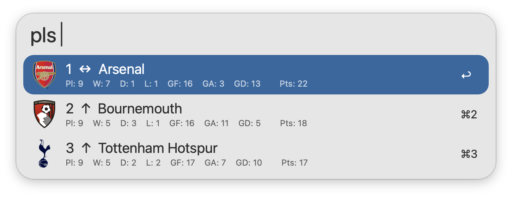
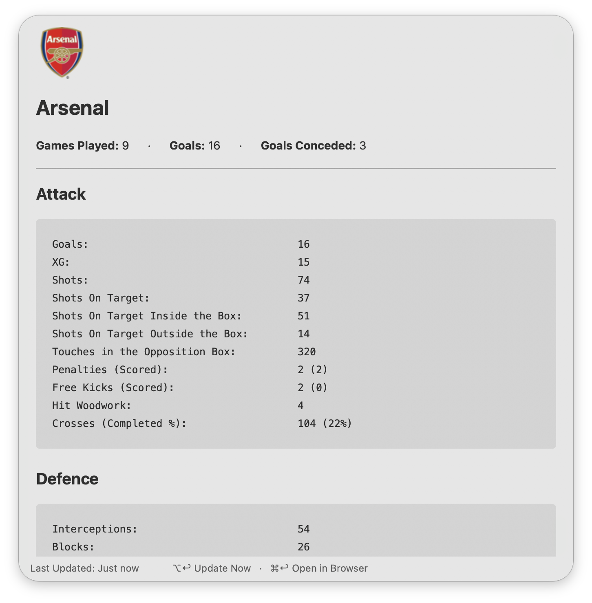
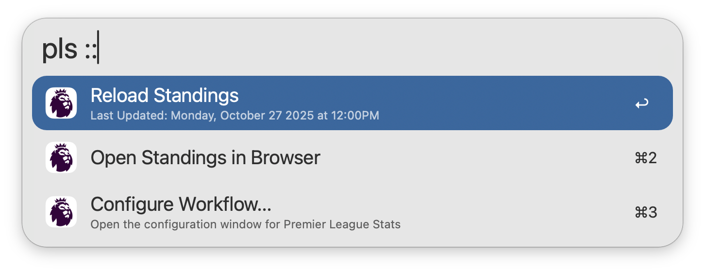

## Usage

View the latest [Premier League](https://www.premierleague.com) standings via the `pls` keyword. Type to filter by Team or Position.

* <kbd>↩</kbd> View Team Stats in Alfred.
* <kbd>⌘</kbd><kbd>↩</kbd> Open Team Stats in Browser.

Additional Team Stats can be viewed directly within Alfred. This includes Attack, Defence, Possession, Physical, and Discipline Stats.

* <kbd>⌘</kbd><kbd>↩</kbd> Open in Browser.
* <kbd>⌥</kbd><kbd>↩</kbd> Refresh Team Stats.

Append `::` to the configured Keyword to access other actions, such as manually reloading the standings cache.

Configure the Hotkey as a shortcut for viewing standings.